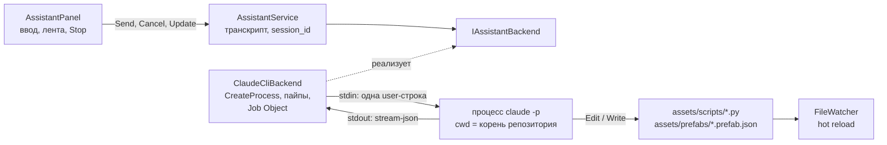
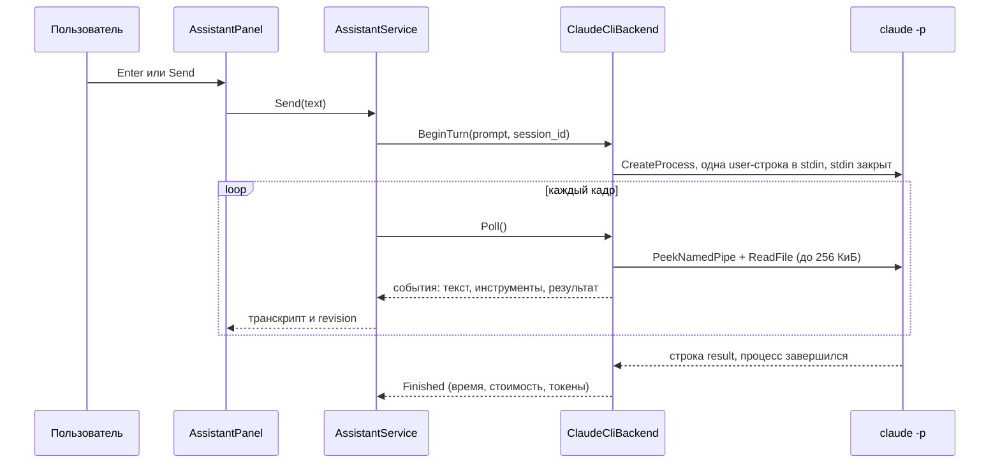

# AI1: панель Assistant (Claude Code CLI)

## Зачем это нужно

В редакторе появилась панель **View → Assistant** (открыта по умолчанию, докится внизу рядом с Prefabs и Script Console). В ней можно задать вопрос по проекту («где лежат скрипты игры и как устроен `GameManager`?») или попросить правку («сделай монете `spin_speed` 300 в префабе»). Ответ приходит потоком, вызовы инструментов и diff правок видны в ленте, список изменённых файлов выводится в конце реплики. Правки идут обычной записью в `assets/scripts/*.py` и `assets/prefabs/*.prefab.json`, дальше их подхватывает hot reload ([T5](../scripting/t5-hot-reload.md), [D1](../scripting/d1-play-reload.md), [T4](../scripting/t4-prefabs.md)): ассистент про редактор и Play ничего не знает.

Под капотом панель запускает установленный у пользователя **Claude Code CLI** (`claude`) как дочерний процесс и читает его вывод в формате stream-json. Своего API-ключа и своих HTTP-запросов в движке нет.

Чего в AI1 **нет** (следующие задачи):

| Чего нет | Где будет |
| --- | --- |
| Инструменты движка (запустить Play, прочитать сцену из памяти, создать сущность), мост MCP | AI2: [ai2-engine-tools.md](ai2-engine-tools.md) |
| Подтверждения «Применить / Отклонить» до выполнения правки | AI2: [ai2-engine-tools.md](ai2-engine-tools.md) |
| Бэкенд по API-ключу (без установленного CLI и без подписки) | AI3 |

В AI1 правка уже записана на диск к моменту, когда она показана в панели; откат — только через git. Это поведение режима без моста `myengine_mcp.exe`; с мостом (AI2) то же правило карточек действует и для файлов.

## Что сделано

| Что | Где | За что отвечает |
| --- | --- | --- |
| `IAssistantBackend`, `AssistantEvent` | [IAssistantBackend.h](../../engine/include/myengine/assistant/IAssistantBackend.h) | Интерфейс бэкенда: `BeginTurn`, `Poll`, `Cancel`, `CheckAvailability`; типы событий |
| `AssistantService` | [AssistantService.h](../../engine/include/myengine/assistant/AssistantService.h), [AssistantService.cpp](../../engine/src/assistant/AssistantService.cpp) | Транскрипт, `session_id`, накопленная стоимость, обработка событий каждый кадр |
| `ClaudeCliBackend` | [ClaudeCliBackend.h](../../engine/include/myengine/assistant/ClaudeCliBackend.h), [ClaudeCliBackend.cpp](../../engine/src/assistant/ClaudeCliBackend.cpp) | Поиск `claude`, `CreateProcess` и пайпы, Job Object, командная строка, временный settings-файл |
| `ClaudeStreamParser` | [ClaudeStreamParser.h](../../engine/include/myengine/assistant/ClaudeStreamParser.h), [ClaudeStreamParser.cpp](../../engine/src/assistant/ClaudeStreamParser.cpp) | Разбор JSON-строк CLI в `AssistantEvent` |
| `AssistantPanel` | [AssistantPanel.h](../../engine/include/myengine/ui/AssistantPanel.h), [AssistantPanel.cpp](../../engine/src/ui/AssistantPanel.cpp) | ImGui-панель: ввод, лента, Stop, New chat, поле пути к CLI |
| Подключение к редактору | [SceneEditor.cpp](../../engine/src/ui/editor/SceneEditor.cpp), [EditorState.h](../../engine/include/myengine/editor/EditorState.h) | Пункт View → Assistant, флаг `showAssistant`, докинг внизу, `Update()` каждый кадр |
| Системный промпт | [system_prompt.md](../../assets/assistant/system_prompt.md) | Краткая карта репозитория, API `myengine`, формат prefab, жёсткие правила |
| Тест `assistant` | [AssistantTests.cpp](../../tests/assistant/AssistantTests.cpp), [FakeClaude.cpp](../../tests/assistant/FakeClaude.cpp) | Автопроверка без настоящего CLI |
| Цель `myengine_assistant_live` | [AssistantLive.cpp](../../tests/assistant/AssistantLive.cpp) | Ручной прогон одной реплики на настоящем CLI (в CTest не входит) |
| Строка лога в `PrefabLibrary` | [PrefabLibrary.cpp](../../engine/src/scene/PrefabLibrary.cpp) | `PrefabLibrary: <имя> detected / changed on disk` при обнаружении изменения файла: единственный след hot reload prefab в логе |

Ветка — `editor/ai1-assistant`. Кроме указанных файлов поменяны только списки исходников в `engine/CMakeLists.txt` и `tests/CMakeLists.txt`, поле `showAssistant` в `EditorState.h` и объявление панели в `SceneEditor.h`.

## Как устроено



Панель не знает про процессы: она работает с `AssistantService`, а тот — с абстрактным `IAssistantBackend`. Бэкенд по API-ключу (AI3) добавится как вторая реализация интерфейса.

### Одна реплика



- **Один процесс на одну реплику.** `claude -p` отвечает на одно сообщение и завершается: бэкенд пишет в stdin одну строку `{"type":"user","message":{...}}` и сразу закрывает stdin.
- **Диалог продолжается через `--resume <session_id>`.** `session_id` приходит в `system/init` и повторно в `result`; сервис хранит его и передаёт в следующий `BeginTurn`. **New chat** забывает его и обнуляет накопленную стоимость.
- **Всё на главном потоке.** Своих потоков у бэкенда нет. Раз в кадр `Poll` делает `PeekNamedPipe` и читает только то, что уже лежит в пайпе (`ReadFile` не ждёт), не больше 256 КиБ stdout за кадр; хвост stderr (последние 2 КиБ) хранится для сообщения об ошибке. `AssistantPanel::Update()` вызывается из `SceneEditor` каждый кадр, **даже когда окно скрыто**, поэтому закрытое окно не копит данные в пайпе и ответ не теряется. Рисование (`Draw`) — только пока окно открыто.
- **Stop** (`Cancel`) завершает процесс через `TerminateJobObject`: процесс помещён в Job Object, поэтому гибнет и всё дерево (CLI запускает помощников). Флаг `JOB_OBJECT_LIMIT_KILL_ON_JOB_CLOSE` убивает дерево и тогда, когда редактор закрыт или упал. Недописанные вызовы инструментов в ленте помечаются как прерванные, добавляется строка `Stopped.`, список уже изменённых файлов выводится как обычно. `session_id` сохраняется: после Stop диалог можно продолжить.
- **Завершение редактора** (`SceneEditor` освобождает панель) завершает процесс и удаляет временный settings-файл.
- Запуск `.cmd`-обёртки (npm) идёт через `cmd.exe /d /s /c`, `.exe` — напрямую; окно консоли не создаётся (`CREATE_NO_WINDOW`).

### Разбор stream-json

`ClaudeStreamParser` читает по одной строке; строка не JSON, оборванная или неизвестного типа — молча пропускается. Используются только эти типы:

| Строка CLI | Что берётся | Событие |
| --- | --- | --- |
| `system` / `init` | `session_id`, `model` | `SessionStarted` |
| `system` / `api_retry` | `attempt`, `max_retries`, `error` | `Notice` (`API retry 2/10: ...`) |
| `stream_event` | `message_start` (id сообщения), `content_block_delta` с `text_delta` | `TextDelta` — текст по кускам |
| `assistant` | блок `text` (только если сообщение не было уже передано дельтами), блок `tool_use` (`id`, `name`, `input`) | `TextDelta`, `ToolUse` |
| `user` | блоки `tool_result` (`tool_use_id`, `is_error`, `content`) | `ToolResult` |
| `result` | `subtype`, `is_error`, `result`, `total_cost_usd`, `duration_ms`, `num_turns`, `usage` | `Finished`; конец реплики |

Сообщения с `parent_tool_use_id` (субагенты) не показываются. Если процесс завершился без строки `result`, бэкенд сам выдаёт `Error` с кодом выхода и хвостом stderr; при `unknown option` в хвосте добавляется подсказка обновить CLI (`claude update`).

Что вычисляется из `tool_use`:

- путь к файлу (`file_path`) показывается относительно корня репозитория, если файл внутри него;
- для `Edit` — diff из `old_string` / `new_string` (строки `- ` и `+ `), для `Write` — предпросмотр `+ ` строк содержимого; не больше 40 строк, строка до 240 байт;
- для `Glob` и `Grep` — шаблон и папка; результат инструмента показывается первыми тремя строками (до 400 байт);
- файл считается изменённым, только когда пришёл `tool_result` без ошибки для `Edit` / `Write`.

Токены в итоговой строке — сумма `input_tokens`, `cache_creation_input_tokens` и `cache_read_input_tokens` (вход) и `output_tokens` (выход).

### Что показывается в панели

| Элемент | Что в нём |
| --- | --- |
| Шапка | **New chat**, **Stop** (активна только во время ответа), `Working...` во время ответа, иначе имя бэкенда и `session cost $…` |
| **Claude Code CLI path** (раскрывающийся блок) | Найденный путь (`Found: ...`), поле ввода пути и **Apply** |
| Реплика пользователя | Заголовок `You` и текст |
| Ответ | Текст, растёт по мере прихода дельт |
| Вызов инструмента | `[...]` в работе, `[done]`, `[failed]` + имя инструмента + краткие аргументы или путь. Если есть diff — строка раскрывается, добавленное зелёное, удалённое красное. Текст ошибки инструмента показывается под строкой |
| Карточка подтверждения (только с мостом, AI2) | Название действия, `Details` (diff или JSON), кнопки **Apply** / **Reject**; подробнее в [ai2-engine-tools.md](ai2-engine-tools.md#что-видно-в-панели) |
| Конец реплики | Серая строка `<время> s \| $<стоимость> \| N in / M out tokens \| K turn(s)`, разделитель |
| Список файлов | `Changed files (hot reload picks them up):` и маркированный список путей, без повторов |
| Ошибка | Красный текст: ошибка результата (`error_max_turns` и т. п.), сбой запуска, недоступный CLI |

Ввод: Enter отправляет, Ctrl+Enter — новая строка. Пока идёт ответ, **Send** отключена. Лента прокручивается вниз сама, если она уже была внизу.

## Ограничения безопасности

> Ниже описан набор AI1 (режим без моста `myengine_mcp.exe`): `--permission-mode dontAsk` и правила `Edit` в settings-файле. С мостом (AI2) режим, `--disallowedTools` и settings-файл другие, а правки файлов подтверждаются карточкой: отличия в [ai2-engine-tools.md](ai2-engine-tools.md#флаги-cli-с-мостом). Режим AI1 остаётся запасным, если `myengine_mcp.exe` не найден рядом с `myengine.exe`.

CLI запускается с таким набором флагов (`ClaudeCliBackend::BuildCommandLine`):

| Флаг | Зачем |
| --- | --- |
| `-p` | Неинтерактивный режим: один запрос, один ответ, процесс завершается |
| `--input-format stream-json` | Запрос приходит в stdin как JSON-строка |
| `--output-format stream-json --verbose --include-partial-messages` | Ответ строками JSON: init, текст по кускам, вызовы инструментов, итог |
| `--permission-mode dontAsk` | В режиме `-p` отвечать на запрос разрешения некому, поэтому всё, что не разрешено в settings-файле, отклоняется без вопроса |
| `--tools "Read,Glob,Grep,Edit,Write"` | Набор встроенных инструментов: чтение, поиск и запись файлов. Оболочки и сети в наборе нет |
| `--disallowedTools "mcp__*"` | `--tools` ограничивает только встроенные инструменты; MCP-инструменты коннекторов аккаунта (claude.ai: Drive, Docs и т. п.) иначе остаются в контексте (в живом прогоне 19 инструментов, около 20 тыс. токенов на запрос). Без них запрос дешевле, а у ассистента нет доступа к чужим сервисам |
| `--settings <файл>` | Временный JSON с правилами (ниже) |
| `--append-system-prompt-file <файл>` | `assets/assistant/system_prompt.md`; флаг пропускается, если файла нет |
| `--max-turns 40` | Предел шагов в одной реплике (значение по умолчанию `ClaudeCliConfig::maxTurns`, `0` отключает флаг) |
| `--max-budget-usd 2.00` | Предел стоимости одной реплики (по умолчанию `maxBudgetUsd = 2.0`, `0` отключает флаг) |
| `--model <имя>` | Только если модель задана в конфиге (из панели не задаётся); имя проверяется на допустимые символы |
| `--resume <session_id>` | Со второй реплики; `session_id` допускает буквы, цифры, `-` и `_`, до 64 символов, иначе в строку не попадает |

Settings-файл пишется перед каждой репликой в `%TEMP%\myengine-assistant\settings-<pid редактора>.json` и удаляется при завершении:

```json
{
  "permissions": {
    "allow": ["Edit(./assets/scripts/**)", "Edit(./assets/prefabs/**)"],
    "deny": ["Bash", "PowerShell", "WebFetch", "WebSearch"]
  }
}
```

Правило `Edit` покрывает и `Write`. Всё остальное, включая C++ код, сцены, шейдеры и `docs/`, для записи закрыто: инструменты чтения видят весь репозиторий, писать можно только в две папки. Правил `allow` для `Read`, `Glob` и `Grep` не нужно: чтение в режиме `dontAsk` работает без них (подтверждено живым прогоном). Рабочая папка процесса — корень репозитория (`MYENGINE_SOURCE_DIR`), поэтому относительные правила и `Read` / `Glob` / `Grep` смотрят на проект.

**`--bare` не используется.** В этом режиме CLI не читает вход по подписке, только `ANTHROPIC_API_KEY` (по документации Claude Code), а AI1 рассчитан на уже выполненный вход пользователя в CLI. Следствие описано в разделе рисков: CLI подхватывает `CLAUDE.md` проекта и пользовательские настройки.

**Сцены файлами не правятся.** Это записано в системном промпте как жёсткое правило: редактор сохраняет открытую сцену при выходе (`Application::Shutdown`) и перезапишет правку файла. Ассистент должен отправить пользователя в Inspector. Правило держится на двух уровнях: промпт запрещает, а `assets/scenes/` вообще не входит в `allow`, поэтому запись в сцену будет отклонена и на уровне CLI. Кроме того, промпт ограничивает правки уже, чем settings: только `assets/scripts/*.py` и `assets/prefabs/*.prefab.json`, тогда как правила разрешают папки целиком (`**`).

Жёсткость блокировки проверена вживую: даже с разрешающим системным промптом попытка `Edit` файла вне `assets/scripts` и `assets/prefabs` отклоняется слоем прав CLI (`Permission to use Edit has been denied because Claude Code is running in don't ask mode`), а правка скрипта проходит. С обычным промптом ассистент сам отказывается править сцену и объясняет, как сделать это в Inspector.

Прочие правила промпта:

- числа баланса лежат в `props` prefab или сцены, логика в Python;
- **перед правкой файл нужно открыть инструментом `Read`** (`Glob` и `Grep` не считаются), иначе `Edit` отвечает `File has not been read yet`;
- минимальная правка без переформатирования, лучше `Edit` с коротким уникальным `old_string`, чем перезапись файла;
- после правки сказать, какой файл и что изменилось;
- изменённый prefab влияет на объекты, созданные **после** правки.

## Как подключить

1. Установить Claude Code CLI по инструкции <https://code.claude.com/docs/en/setup>.
2. Один раз выполнить вход **вне редактора** (`claude auth login` в терминале). Редактор вход не делает и ключей не хранит.
3. Запустить редактор. Панель сама найдёт `claude`.

Порядок поиска (`ClaudeCliBackend::FindExecutable`):

| Шаг | Источник | Если файла нет |
| --- | --- | --- |
| 1 | Путь из поля **Claude Code CLI path** в панели (кнопка **Apply** или Enter) | Ошибка `The configured Claude Code CLI path does not exist`, поиск дальше не идёт |
| 2 | Переменная окружения `MYENGINE_CLAUDE_PATH` | Ошибка `MYENGINE_CLAUDE_PATH points to a file that does not exist`, поиск дальше не идёт |
| 3 | `PATH`: `claude.exe`, затем `claude.cmd` | Переход к шагу 4 |
| 4 | `%USERPROFILE%\.local\bin\claude.exe` (нативный установщик) | Переход к шагу 5 |
| 5 | `%APPDATA%\npm\claude.cmd` (установка через npm) | Сообщение «не найден» |

Путь из поля **не сохраняется** между запусками редактора; для постоянной настройки задайте `MYENGINE_CLAUDE_PATH`. Пустое поле + **Apply** возвращает автоматический поиск.

Если CLI не найден, панель не падает и редактор работает дальше: в шапке красная надпись `Claude Code CLI not found`, под ней текст `Claude Code CLI was not found. Install it (https://code.claude.com/docs/en/setup) and make sure claude is in PATH, or set its full path below or in the MYENGINE_CLAUDE_PATH environment variable.` Попытка отправить сообщение добавляет в ленту ту же ошибку, а сообщение пользователя в ленту не попадает. Проверка доступности выполняется на первом кадре и перед каждой отправкой, процесс при этом не запускается.

## Как проверить

### Вручную

Нужны установленный и авторизованный `claude` и сборка редактора (`run.bat`). Сценарии из карточки AI1 (те же три прогнаны на живом CLI через `myengine_assistant_live`, результаты ниже):

1. **Без CLI.** Указать в поле пути несуществующий файл и нажать Apply (или запустить без `claude` в `PATH`): красная надпись в шапке, понятное сообщение, отправка добавляет ошибку в ленту, редактор не падает.
2. **Вопрос.** Отправить «где лежат скрипты игры и как устроен GameManager?»: ответ идёт потоком, в ленте видны вызовы `Read` / `Glob` / `Grep`, в конце серая строка с временем, стоимостью и токенами. Ожидаемо, что ответ сошлётся на `assets/scripts/game_manager.py`.
3. **Правка prefab.** Отправить «сделай монете spin_speed 300 в префабе»: в ленте раскрываемый вызов `Edit` с diff `- "spin_speed": 120.0` / `+ "spin_speed": 300.0`, затем список `assets/prefabs/coin.prefab.json`; в файле значение изменилось (`git diff assets/prefabs/coin.prefab.json`). После проверки вернуть файл: `git checkout -- assets/prefabs/coin.prefab.json`.
4. **Hot reload.** Для скриптов в `logs/myengine.log` появится `ScriptSystem: hot reload <файл>.py`. Для prefab — строка `PrefabLibrary: coin detected / changed on disk` (при старте такая строка пишется по одной на каждый prefab: это первое сканирование; при правке файла появляется новая). Дополнительно: в Play выполнить в консоли `me.world.spawn("coin", me.Vec3(0, 0.5, 0))` и убедиться, что новая монета вращается быстрее, либо открыть панель Prefabs.
5. **Stop.** Отправить длинный запрос («прочитай все скрипты и перескажи каждый»), нажать **Stop**: ответ прерывается сразу (в автотесте на это отведено меньше 2 с), появляется `Stopped.`, процесс `claude` исчезает из диспетчера задач, следующий вопрос работает и продолжает диалог.
6. **Отзывчивость.** Во время ответа открыть окно Statistics: FPS заметно не падает (чтение пайпа ограничено 256 КиБ за кадр и не блокирует поток). Замеров FPS в репозитории нет, критерий проверяется глазами.

### Живой прогон без редактора: `myengine_assistant_live`

Цель собирается вместе с тестами, но **в CTest не входит**: она запускает настоящий `claude`, тратит деньги и требует выполненного входа в CLI. Она прогоняет одну реплику через тот же `ClaudeCliBackend` (те же флаги, тот же settings-файл и системный промпт, что в редакторе) и печатает события по мере прихода: `[session ...]`, текст, `[tool] ...` с diff, `[result] ... -> changed <файл>`, `[finished]` со временем, стоимостью и токенами, в конце `[wall ... ms, longest Poll ... ms]`. Код выхода 0 — реплика завершилась без ошибки.

```powershell
myengine_assistant_live [--dir <корень>] [--session <id>] [--model <имя>] [--stop-after <мс>] (--prompt-file <utf-8 файл> | <текст>)
```

| Параметр | Что делает |
| --- | --- |
| `--dir <корень>` | Рабочая папка процесса (корень репозитория). По умолчанию текущая папка |
| `--session <id>` | Продолжить диалог (`--resume`); `session_id` печатается в строках `[session ...]` и `[finished]` |
| `--model <имя>` | Модель CLI. По умолчанию модель CLI |
| `--stop-after <мс>` | Через столько миллисекунд вызвать `Cancel` и вывести `[cancelled in ... ms, busy=...]`: проверка Stop |
| `--prompt-file <файл>` | Текст запроса из UTF-8 файла (удобно для кириллицы в консоли) |
| `<текст>` | Запрос прямо в командной строке |

Системный промпт берётся из `assets/assistant/system_prompt.md` под `--dir`, если там его нет, то из исходников движка (`MYENGINE_SOURCE_DIR`). Рекомендуется запускать на копии рабочего дерева или откатывать правки через `git checkout`: реплика правит настоящие файлы.

#### Результаты живых прогонов

Windows, `Debug`, `claude` установлен через npm (`claude.cmd`), Claude Code 2.1.296, модель по умолчанию `claude-opus-5-5`, запуск `myengine_assistant_live` на рабочем дереве ветки `editor/ai1-assistant`.

| Сценарий | Результат |
| --- | --- |
| «где лежат скрипты игры и как устроен GameManager?» | Осмысленный ответ потоком, с файлами и строками. 23 с, $0.13, 52 тыс. входных токенов (до отключения MCP-инструментов `--disallowedTools "mcp__*"`). Самый долгий `Poll` — 7 мс |
| «сделай монете spin_speed 300 в префабе» | `Read`, затем `Edit` файла `assets/prefabs/coin.prefab.json` (`120.0` → `300.0`); показан diff и `changed files`. При запущенном редакторе в логе появилась строка `PrefabLibrary: coin detected / changed on disk`. 9.7 с, $0.046. Правка откатана через `git checkout` |
| Stop через 9 с посреди длинного ответа | `Cancel` занял 0.7 мс, бэкенд не занят, новых процессов `claude` и `node` не осталось (списки процессов сравнивались до и после). Следующая реплика с `--session` продолжила диалог и ответила, какие файлы успела посмотреть |
| Попытка правки вне `assets/scripts` и `assets/prefabs` | С разрешающим системным промптом `Edit` отклонён слоем прав: `Permission to use Edit has been denied because Claude Code is running in don't ask mode`; правка скрипта прошла. С обычным промптом ассистент сам отказывается править сцену и объясняет, как это сделать в Inspector |

Логов этих прогонов в репозитории нет. Прогоны шли через консольную цель, а не через окно редактора: FPS панели в Statistics отдельно не мерили.

### Автотесты

```powershell
ctest --test-dir build -C Debug -R assistant --output-on-failure
```

Тест `assistant` (цель `myengine_assistant_tests`, таймаут 120 с) не требует установленного Claude: вместо него запускается заглушка `myengine_fake_claude` (`FakeClaude.cpp`), которую собирают рядом с тестом. Заглушка читает stdin до конца, печатает настоящие stream-json строки и завершается; режим берётся из переменной `FAKE_CLAUDE_MODE`: `normal`, `hang` (молчит минуту), `crash` (код 3, в stderr `unknown option`), `split` (строка init разрезана на две записи), `error_result` (`result` с `error_max_turns`). Благодаря этому тест проходит через настоящие `CreateProcess`, пайпы и Job Object, а не через макет. Рабочая папка теста содержит кириллицу и пробел (как `C:\Users\<имя>`), чтобы поймать ошибки кодировки путей. Заглушка не заменяет проверку на живом CLI: для неё есть `myengine_assistant_live` (выше).

Этапы теста (по порядку в `main()`):

| Этап | Что проверяет |
| --- | --- |
| `parser` | `init` → `SessionStarted`; дельты текста не дублируются итоговым сообщением; мусорные и оборванные строки пропускаются; субагент не протекает; путь внутри корня показан относительным (регистр диска не важен), вне корня остаётся полным; diff `Edit`, предпросмотр `Write`, сводка `Grep`; результат инструмента урезан до трёх строк; успешная правка сообщает файл, неудачная нет; `result` даёт стоимость, время, число шагов, токены (1110 / 40); `error_max_turns` становится ошибкой |
| `command line and settings` | Флаги `-p`, stream-json, `--verbose`, `--include-partial-messages`, `--permission-mode dontAsk`, `--tools "Read,Glob,Grep,Edit,Write"`, `--disallowedTools "mcp__*"`, `--max-turns 7`, `--max-budget-usd 1.50`, `--resume`, `--settings`; отсутствующий файл промпта не передаётся; враждебный `session_id` (`x" --dangerously-skip-permissions`) не попадает в строку; правила `Edit(./assets/scripts/**)`, `Edit(./assets/prefabs/**)` и deny для `Bash`; сообщение пользователя в stdin переживает кавычки, перевод строки и кириллицу. Добавлено в AI2: с мостом в командной строке `--permission-mode default`, `--mcp-config`, `--strict-mcp-config`, `--permission-prompt-tool mcp__myengine__approve`, без `dontAsk`; settings содержит `allow` только для чтений движка и `deny` для `Edit(./assets/scenes/**)`; конфиг MCP несёт имя пайпа и токен |
| `CLI not found` | Несуществующий путь даёт понятное сообщение, `Send` отказывает, процесс не стартует, отклонённое сообщение не попадает в ленту |
| `full turn and resume` | Реплика через заглушку: поток текста без дублей, `session_id` сохранён, вызов `Edit` помечен выполненным и с diff, список изменённых файлов, итоговая строка и накопление стоимости; вторая отправка во время ответа отклоняется; вторая реплика идёт с `--resume fake-session-1`; **New chat** сбрасывает ленту, сессию и стоимость |
| `cancel` | Пока процесс молчит, `Poll` не блокируется (худший вызов < 50 мс за 50 вызовов); `Cancel` быстрее 2 с, процесс заглушки действительно завершён, после `Cancel` событий нет; через сервис: Stop оставляет `Stopped.`, а следующая реплика продолжает ту же сессию |
| `crash, split line, error result` | Падение процесса объясняется (код выхода, хвост stderr, подсказка `claude update`); строка, разрезанная между двумя чтениями, не теряется; `error_max_turns` показывается как ошибка, панель остаётся рабочей |
| `bounded transcript` | 800 вызовов инструментов дают не больше 500 сообщений; один текст не растёт за предел; `Finished` закрывает реплику, следующая несёт `session_id` |
| `panel` | Настоящий ImGui-контекст без окна: панель с недоступным бэкендом рисуется и показывает причину; реплика через заглушку рисуется кадр за кадром и даёт список файлов; панель, созданная по корню репозитория, не запускает процесс сама |

Итоговая строка теста: `OK: AI1 stream parser, CLI arguments and settings, pipes without blocking, resume, Stop, crash handling, bounded transcript, panel`.

Автотесты не проверяют: настоящий `claude` (его проверяет вручную `myengine_assistant_live`), поиск CLI через `PATH`, `MYENGINE_CLAUDE_PATH` и стандартные папки, гибель **дочерних** процессов CLI (тест смотрит на сам процесс заглушки; в живом прогоне Stop оставил список процессов `claude` и `node` без новых), внешний вид панели (цвета, раскрытие diff) и FPS. Запуск `.cmd` через `cmd.exe` автотест не покрывает, но на живом прогоне с npm-установкой (`claude.cmd`) он сработал.

## Ограничения и известные риски

- **Проверено на одной версии CLI.** Живые прогоны выполнены на Claude Code 2.1.296: все флаги из таблицы существуют в `claude --help` этой версии. Формат строк и набор флагов зависят от версии CLI; если версия старая, процесс завершится с `unknown option`, и панель подскажет `claude update`. Прогоны выполнены в Debug с npm-установкой (`claude.cmd`); другие конфигурации и нативный `claude.exe` в них не участвовали.
- **Нет `--bare`, значит CLI читает окружение.** Подхватываются `CLAUDE.md` проекта (поэтому системный промпт просит игнорировать описание команды агентов) и, по документации Claude Code, пользовательские и проектные настройки. Их правила `allow` могут расширить права сверх файла `--settings`. На живом CLI это отдельно не проверялось (жёсткая блокировка записи вне двух папок проверена, но при настройках пользователя по умолчанию). Коннекторы аккаунта (MCP) отключены флагом `--disallowedTools "mcp__*"`.
- **Время кадра.** В Debug самый долгий разбор одного кадра (`Poll`) в живых прогонах — около 7–12 мс при больших строках результата инструментов. Для сравнения, кадр при 60 FPS длится 16.7 мс. FPS в редакторе при ответе отдельно не мерили (Statistics не снимали). Критерий «FPS не падает заметно» остаётся на ручную проверку.
- **Задержка старта.** Новый процесс на каждую реплику: CLI запускается и поднимает сессию заново через `--resume`, поэтому первый текст приходит не мгновенно. Задержку старта отдельно не мерили; для ориентира в живых прогонах весь короткий ответ с одной правкой занял 9.7 с.
- **Правки сразу на диске.** Нет кнопок «Применить / Отклонить», Ctrl+Z редактора на файлы не действует; откат — git. Править ассистент может только файлы в `assets/scripts` и `assets/prefabs` рабочей копии (корень берётся из `MYENGINE_SOURCE_DIR`). *В AI2 при работающем мосте правка файла подтверждается карточкой до записи; Ctrl+Z на файлы по-прежнему не действует.*
- **Диалог без инструментов движка.** Ассистент не видит сцену в памяти, не запускает Play и сборку, не знает, какая сущность выбрана; изменение prefab не влияет на уже созданные объекты; сцену он файлами не правит и может лишь подсказать, что поменять в Inspector. *В AI2 при работающем мосте он читает сцену, меняет её и запускает Play инструментами движка: [ai2-engine-tools.md](ai2-engine-tools.md). Сборку по-прежнему не запускает.*
- **Лимиты.** Лента хранит 500 сообщений (старые вытесняются), текст одного ответа растёт до 256 КиБ, панель показывает до 64 КиБ одного сообщения; запрос — до 128 КиБ; одна JSON-строка CLI — до 16 МиБ. Стоимость реплики ограничена `--max-budget-usd 2.00`, число шагов — `--max-turns 40`; из панели они не настраиваются.
- **Стоимость в панели** — значение `total_cost_usd` из `result`. Что оно означает при работе по подписке, уточнить.
- **Только Windows.** `ClaudeCliBackend` использует Win32 (`CreateProcess`, Job Object, `PeekNamedPipe`).
- **Условия использования.** Это личный инструмент разработчика на своей машине: редактор запускает собственный установленный Claude Code пользователя. Раздавать редактор вместе со входом по подписке нельзя, сторонним продуктам Anthropic такой вход не разрешает; для раздачи нужен бэкенд по API-ключу (AI3).
