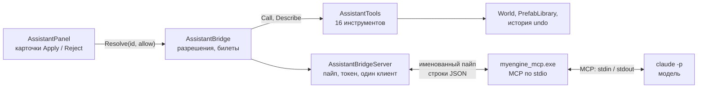
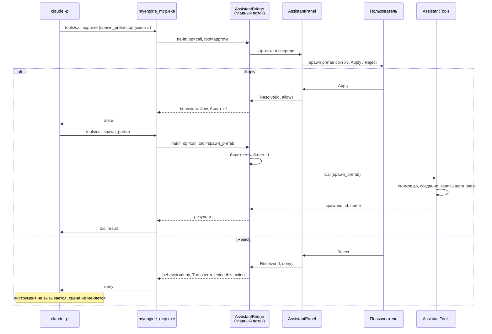

# AI2: инструменты движка и подтверждения (MCP-мост)

## Зачем это нужно

В AI1 ассистент умел только читать репозиторий и править файлы: сцену в памяти он не видел, а правка падала на диск до того, как пользователь на неё посмотрел. AI2 даёт ему руки внутри редактора и ставит между его намерением и результатом подтверждение.

Сценарий: пользователь пишет «поставь 3 монеты вокруг игрока». Ассистент читает сцену (`list_entities`, `list_prefabs`: без вопросов), затем вызывает `spawn_prefab`. В панели появляется **карточка** «Spawn prefab 'coin' x3 at (…)» с кнопками **Apply** и **Reject**.

- **Apply** → монеты появляются в открытой сцене, одним шагом истории; **Ctrl+Z** их убирает.
- **Reject** → сцена не меняется, модель получает отказ «The user rejected this action» и спрашивает, что сделать вместо этого.

То же подтверждение теперь стоит и перед правкой файла (`Edit` / `Write`): карточка с diff показывается **до** записи, а не после, как в AI1.

Под капотом Claude Code CLI запускает маленький MCP-сервер `myengine_mcp.exe`, а тот пересылает вызовы в редактор через именованный пайп. Все инструменты выполняются на главном потоке редактора, в том же кадре, где его обычный код. Своего API-ключа и HTTP-запросов по-прежнему нет.

Чего в AI2 **нет**:

| Чего нет | Почему / где будет |
| --- | --- |
| `run_python`, shell, правка C++ | Выключено по условию задачи: ассистент не исполняет произвольный код и не правит `engine/`, `app/`, `tests/` |
| Правка сцены файлами | Редактор перезаписывает открытую сцену при выходе; сцену ассистент меняет только инструментами движка |
| Бэкенд по API-ключу | AI3 |

## Что сделано

| Что | Где | За что отвечает |
| --- | --- | --- |
| `AssistantTools` | [AssistantTools.h](../../engine/include/myengine/assistant/AssistantTools.h), [AssistantTools.cpp](../../engine/src/assistant/AssistantTools.cpp) | Реестр из 16 инструментов: имя, описание, JSON-схема, флаг «меняет мир», обработчик; проверка аргументов, снимки сцены для undo |
| `AssistantBridge` | [AssistantBridge.h](../../engine/include/myengine/assistant/AssistantBridge.h), [AssistantBridge.cpp](../../engine/src/assistant/AssistantBridge.cpp) | Диспетчер запросов моста, очередь подтверждений, правила разрешений, «билеты» подтверждённых вызовов |
| `AssistantBridgeServer` | [AssistantBridgeServer.h](../../engine/include/myengine/assistant/AssistantBridgeServer.h), [AssistantBridgeServer.cpp](../../engine/src/assistant/AssistantBridgeServer.cpp) | Серверная сторона именованного пайпа: токен, один клиент, неблокирующий опрос с главного потока |
| `McpBridgeCore` | [McpBridgeCore.h](../../engine/include/myengine/assistant/McpBridgeCore.h) | Протокол MCP (`initialize`, `ping`, `tools/list`, `tools/call`); только заголовок, без зависимостей от Windows и движка, поэтому его же использует тест |
| `myengine_mcp.exe` | [main.cpp](../../app/mcp_bridge/main.cpp), [app/CMakeLists.txt](../../app/CMakeLists.txt) | MCP по stdio для CLI; клиентская сторона пайпа. Собирается вместе с редактором (`add_dependencies(myengine myengine_mcp)`), лежит рядом с `myengine.exe` |
| Флаги и файлы CLI | [ClaudeCliBackend.h](../../engine/include/myengine/assistant/ClaudeCliBackend.h), [ClaudeCliBackend.cpp](../../engine/src/assistant/ClaudeCliBackend.cpp) | `ClaudeCliBridge` в конфиге, `--mcp-config`, `--strict-mcp-config`, `--permission-prompt-tool`, временный файл `mcp-<pid>.json`, другой settings-файл |
| Карточки в панели | [AssistantPanel.h](../../engine/include/myengine/ui/AssistantPanel.h), [AssistantPanel.cpp](../../engine/src/ui/AssistantPanel.cpp) | Запуск моста, `DrawApprovals` (Apply / Reject), снятие карточек при Stop и конце реплики |
| Контекст инструментов | [SceneEditorAssistant.cpp](../../engine/src/ui/editor/SceneEditorAssistant.cpp), [SceneEditor.cpp](../../engine/src/ui/editor/SceneEditor.cpp) | `InitializeAssistant`: мир, prefab, снимки сцены, undo, сохранение, сведения о скриптах |
| `BuildToolDetail`, `AddNotice` | [ClaudeStreamParser.cpp](../../engine/src/assistant/ClaudeStreamParser.cpp), [AssistantService.cpp](../../engine/src/assistant/AssistantService.cpp) | Тот же diff для карточки, что и в ленте; строки `Applied: …` / `Rejected: …` в транскрипте |
| Системный промпт | [system_prompt.md](../../assets/assistant/system_prompt.md) | Раздел «Engine tools»: что читать, что подтверждается, как вести себя после отказа |
| Тест `assistant_bridge` | [AssistantBridgeTests.cpp](../../tests/assistant/AssistantBridgeTests.cpp) | Автопроверка инструментов, настоящего `myengine_mcp.exe` по настоящему пайпу, подтверждений и разрешений |
| `--engine-tools` в живой цели | [AssistantLive.cpp](../../tests/assistant/AssistantLive.cpp) | Ручной прогон на настоящем CLI с headless-сценой, мостом и ответами на карточки |

Ветка — `editor/ai2-assistant-tools`. Кроме указанных файлов поменяны списки исходников в `engine/CMakeLists.txt` и `tests/CMakeLists.txt`, объявления в `SceneEditor.h` и `AssistantService.h`, а также проверки командной строки AI2 добавлены в [AssistantTests.cpp](../../tests/assistant/AssistantTests.cpp).

## Как устроено



Редактор владеет пайпом и инструментами; процесс `claude` и мост `myengine_mcp.exe` — отдельные процессы, которые создаёт CLI на время одной реплики. Панель владеет `AssistantBridge` и передаёт его пайп, токен и список инструментов в конфигурацию `ClaudeCliBackend`; `AssistantService` про инструменты ничего не знает, ему мост присылает только строки транскрипта (`AddNotice`).

### Один вызов с подтверждением



Что происходит по шагам:

1. Модель решает вызвать `mcp__myengine__spawn_prefab`. Инструмент не в списке `allow` settings-файла, поэтому CLI (режим `--permission-mode default`) сначала вызывает **permission prompt tool** `mcp__myengine__approve` с именем инструмента и его аргументами.
2. Мост пересылает вызов в редактор. `AssistantBridge::HandleApprove` для изменяющего инструмента не отвечает сразу: он кладёт карточку в очередь и **держит ответ**. Процесс `claude` ждёт.
3. Панель рисует карточку. Нажатие **Apply** / **Reject** вызывает `AssistantBridge::Resolve`; ответ `allow` / `deny` уходит в мост и дальше в CLI. При `allow` бридж записывает «билет» на этот инструмент.
4. После `allow` CLI делает настоящий `tools/call`. `AssistantBridge::HandleCall` проверяет и гасит билет, вызывает `AssistantTools::Call`, возвращает результат JSON.

Чтения (`get_mode`, `list_entities` и т. д.) в `allow` settings-файла уже есть, поэтому CLI их не спрашивает вовсе; если всё-таки спросит, `HandleApprove` разрешит сразу.

### Инструменты

Имена в CLI имеют вид `mcp__myengine__<имя>`; в ленте панели префикс заменяется на `engine.` (`[done] engine.list_entities`). `AssistantTools::List()` отдаёт 16 инструментов; в ответ на `tools/list` к ним добавляется служебный `approve`.

#### Чтение (без подтверждения)

| Инструмент | Что делает | Ключевые аргументы |
| --- | --- | --- |
| `get_mode` | Режим редактора (`Edit` / `Play`), есть ли несохранённые изменения, число сущностей, выбранная сущность | нет |
| `list_entities` | Список сущностей: `id`, имя, позиция, список компонентов, родитель | `filter` (часть имени без учёта регистра), `limit` (по умолчанию 100, максимум 500). В ответе `total`, `matched`, `returned` |
| `get_entity` | Все данные одной сущности в формате файла сцены; в Play ещё `liveScripts`: статус и текущие значения полей скриптов | `id` или `name` |
| `list_prefabs` | Имена шаблонов из `assets/prefabs` | нет |
| `get_prefab` | JSON одного шаблона | `name` (обязателен) |
| `list_scripts` | Модули в `assets/scripts` и их классы (файлы с `_` в начале пропускаются; классы ищутся по строкам, начинающимся с `class `) | нет |
| `describe_script_fields` | Редактируемые поля класса скрипта: имя, тип, значение по умолчанию | `module`, `class` (оба обязательны) |
| `get_recent_errors` | Последние 10 ошибок скриптов, новые первыми: файл, строка, время, сообщение (до 700 символов) | нет |

#### Изменения (карточка перед каждым вызовом)

| Инструмент | Что делает | Ключевые аргументы | Режим | Шаг undo |
| --- | --- | --- | --- | --- |
| `spawn_prefab` | Создаёт сущности из prefab (вместе с дочерними). Всё или ничего: при ошибке на любой копии сцена возвращается к состоянию до вызова | `name` (обязателен), `position` или `positions` (до 50 копий) | Edit | `Assistant: Spawn <имя>` |
| `create_entity` | Создаёт сущность из компонентов в формате файла сцены. Допустимы `Tag`, `Transform`, `MeshRenderer`, `Rigidbody`, `Collider`, `Camera`, `CameraController`, `Motion`, `PlayerController`, `WindowBinding`, `Script`; `Hierarchy` не принимается | `name`, `position`, `components` | Edit | `Assistant: Create Entity` |
| `delete_entity` | Удаляет сущность вместе с дочерними; если она была выбрана, выбор сбрасывается | `id` или `name` | Edit | `Assistant: Delete Entity` |
| `set_script_props` | Меняет `props` скрипта у сущности: значения вливаются в существующие. Имя поля проверяется по классу (опечатка отклоняется с перечнем полей), тип значения тоже | `id` или `name`, `index` (по умолчанию 0), `props` (обязателен) | Edit | `Assistant: Edit Script Props` |
| `set_component` | Меняет поля компонента: значение вливается в JSON компонента из файла сцены. Допустимы `Tag`, `Transform`, `MeshRenderer`, `Rigidbody`, `Collider`, `Camera`, `CameraController`, `Motion`, `PlayerController`, `WindowBinding` | `id` или `name`, `component`, `value` (оба обязательны) | Edit | `Assistant: Edit <компонент>` |
| `play` | Включает Play (то же, что кнопка Play в тулбаре) | нет | только из Edit | нет |
| `stop` | Выключает Play и восстанавливает сцену из снимка (то же, что кнопка Stop) | нет | только из Play | нет |
| `save_scene` | Сохраняет сцену в её файл и сбрасывает признак несохранённых изменений | нет | Edit | нет |

Что важно знать:

- **Шаг undo есть у пяти инструментов, меняющих сцену** (`spawn_prefab`, `create_entity`, `delete_entity`, `set_script_props`, `set_component`): один вызов — один шаг. `play`, `stop` и `save_scene` сцену не правят и шага не оставляют.
- Изменение сцены вне Edit отклоняется: «The scene can be changed only in Edit mode. Call stop first (the game is running).» Чтения работают в обоих режимах.
- Шаг undo не записывается, если сцена после вызова не изменилась (снимки «до» и «после» совпали).
- Сущность задаётся `id` (из `list_entities`) или `name`; по имени берётся первая совпавшая сущность. Для несуществующей возвращается ошибка с подсказкой вызвать `list_entities`.
- Ответ инструмента обрезается на 60 КиБ (`... (truncated)`).

#### Откуда берётся undo

Редактор откатывает изменения сцены снимками всей сцены, а не командами по сущностям. Инструмент перед изменением берёт снимок (`captureSnapshot`), делает работу и передаёт его в `recordUndo`; `SceneEditor::RecordSceneMutationImmediate` кладёт в историю команду «восстановить снимок до / после». Поэтому Ctrl+Z (и **Edit → Undo**) работает как для ручных правок, а метка шага видна как `Assistant: …`. Undo и redo доступны только в Edit.

### Правила разрешений

Решение по запросу permission prompt принимает `AssistantBridge::HandleApprove`; настройки CLI только добавляют второй слой.

| Что хочет сделать модель | Решение | Что пользователь видит |
| --- | --- | --- |
| Инструмент движка, **чтение** | Разрешено сразу | Ничего |
| Инструмент движка, **изменение** | Карточка; после Apply выдаётся билет на один вызов | Карточка с названием и JSON аргументов |
| Неизвестный инструмент `mcp__myengine__…` | Отказ `Unknown tool.` | Ничего |
| `Edit` / `Write` / `MultiEdit` / `NotebookEdit` **для `.py` прямо в `assets/scripts` или `.prefab.json` прямо в `assets/prefabs`** | Карточка с diff до записи | Карточка `Edit assets/scripts/coin.py` (или `Write …`) с diff |
| Те же инструменты для любого другого пути | Отказ с сообщением: «Only .py files in assets/scripts and .prefab.json files in assets/prefabs may be edited. Scenes are changed with the engine tools or in the Inspector, not as files.» | Ничего (модель получает отказ и объясняет) |
| `Read` / `Glob` / `Grep` внутри репозитория (или без пути) | Разрешено сразу | Ничего |
| `Read` / `Glob` / `Grep` вне репозитория | Отказ `Files outside the repository cannot be read.` | Ничего |
| Всё остальное (`Bash` и прочее) | Отказ `The tool <имя> is not available to the assistant.` | Ничего |

Подробности проверки пути (`IsEditable`, `IsInsideRepository`):

- Относительный путь считается от корня репозитория; регистр и вид слэшей не важны.
- Путь должен лежать **непосредственно** в нужной папке: подпапки не допускаются; путь с `..` отклоняется.
- Файл сцены (`assets/scenes/*.json`), C++ (`engine/`, `app/`, `tests/`), `docs/`, шейдеры, `.txt` в `assets/scripts` — отказ.
- Для `Edit(./assets/scenes/**)` есть дополнительное правило `deny` в settings-файле CLI.

#### Билет подтверждения

Подтверждение выдаётся не на «вообще разрешено», а на один будущий вызов:

- `Resolve(id, allow=true)` увеличивает счётчик «билетов» на имя инструмента (`tickets_`).
- Пришедший `tools/call` на изменяющий инструмент **без билета отклоняется**: «This change was not confirmed in the editor, so it was not made.» Билет гасится одним вызовом, поэтому одно подтверждение не покрывает второй такой же вызов.
- Билет привязан к имени инструмента, а не к конкретным аргументам; проверки «те же ли аргументы» нет (аргументы прошли через `updatedInput` CLI).
- Билеты сбрасываются при `RejectAll` и при обрыве соединения с мостом (CLI-процесс реплики завершился).

Это защита на случай, если изменяющий инструмент будет вызван в обход permission prompt (например, если правило `allow` в пользовательских настройках CLI разрешит его без вопроса): изменение всё равно не пройдёт.

#### Судьба карточки

| Событие | Что происходит с карточкой |
| --- | --- |
| Apply / Reject | `Resolve`: ответ уходит в CLI; в ленту пишется `Applied: <название>` или `Rejected: <название>` |
| **Stop** или реплика закончилась, карточки ещё открыты, а мост ещё подключён | Следующий `AssistantPanel::Update()` вызывает `RejectAll("The turn ended before the action was confirmed.")`: все карточки закрываются как отказ, билеты сбрасываются, в ленте `Rejected: …`. Эту ветку проверяет тест `panel cards` |
| Процесс `myengine_mcp.exe` умер (например, Stop завершил всё дерево CLI вместе с мостом) | Пайп отдаёт обрыв: карточки очищаются без ответа (отвечать некому), билеты сбрасываются, пайп снова слушает. Строки `Rejected: …` в ленте в этом случае нет. Какая из двух веток сработает при реальном Stop, зависит от порядка в кадре (`bridge_->Update()` идёт раньше проверки `IsBusy`) |
| Редактор закрывается | `AssistantBridge::Stop` отклоняет карточки (`The editor closed the assistant bridge.`) и закрывает пайп |

Карточка рисуется только пока окно **Assistant** открыто (рисование — как в AI1: только в открытом окне); опрос моста идёт каждый кадр и при скрытом окне.

### Что видно в панели

К таблице [из AI1](ai1-assistant-panel.md) добавляются:

| Элемент | Что в нём |
| --- | --- |
| Карточка подтверждения | Жёлтое `Confirm`, название действия, раскрывающийся блок `Details` (открыт по умолчанию), кнопки **Apply** (зелёная) и **Reject**. Для правки файла `Details` — diff (добавленное зелёное, удалённое красное), для инструмента движка — JSON аргументов |
| Вызов инструмента движка | `[...]` / `[done]` / `[failed]` и имя вида `engine.spawn_prefab` |
| Строка `Applied: …` / `Rejected: …` | Служебная строка в ленте после решения |

Текст карточки для инструментов формирует `AssistantTools::Describe`:

| Инструмент | Заголовок карточки |
| --- | --- |
| `spawn_prefab` | `Spawn prefab 'coin' x3 at (1, 0, 2), (3, 0, 4), ...` (в заголовке не больше 4 позиций) |
| `create_entity` | `Create entity '<имя>'` |
| `delete_entity` | `Delete entity #<id> '<имя>' with its children` |
| `set_script_props` | `Set script props on #<id> '<имя>'` |
| `set_component` | `Change component <компонент> of #<id> '<имя>'` |
| `play` / `stop` / `save_scene` | `Start the game (Play)` / `Stop the game and restore the scene` / `Save the scene to its file` |

## Безопасность моста

| Мера | Где | Что даёт |
| --- | --- | --- |
| Имя пайпа `\\.\pipe\myengine-assistant-<pid редактора>` | `AssistantBridgeServer::DefaultPipeName` | Несколько запущенных редакторов не мешают друг другу |
| `PIPE_REJECT_REMOTE_CLIENTS` | `AssistantBridgeServer::Start` | Пайп недоступен по сети, только локальным процессам |
| `FILE_FLAG_FIRST_PIPE_INSTANCE`, максимум 1 экземпляр | `AssistantBridgeServer::Start` | Нельзя подставить пайп с тем же именем поверх; **один клиент за раз**. Второй `AssistantBridge` на том же имени не стартует (проверено тестом) |
| Токен: 32 шестнадцатеричных символа, новый на каждый запуск редактора | `AssistantBridge::RandomToken` | Без токена пайп никому не служит |
| Токен приходит в **переменной окружения** `MYENGINE_BRIDGE_TOKEN` процесса моста (поле `env` в `--mcp-config`), в командной строке его нет | `ClaudeCliBackend::BuildMcpConfigJson` | Токена нет в списке процессов; в аргументах только имя пайпа |
| Первая строка клиента — `{"op":"hello","token":"…"}`; неверный токен или любая другая первая строка — разрыв соединения, ответа нет | `AssistantBridgeServer::Poll` | Чужой процесс на пайпе получает отказ; проверено тестом |
| Файл `mcp-<pid>.json` в `%TEMP%\myengine-assistant` хранит токен; удаляется при завершении бэкенда | `ClaudeCliBackend::Shutdown` | Токен живёт столько же, сколько редактор |
| Опрос пайпа только с главного потока: `PeekNamedPipe` + чтение до 16 КиБ за кадр, запись с таймаутом 2 с, строка не длиннее 8 МиБ | `AssistantBridgeServer` | Нет своих потоков и гонок за мир; инструменты выполняются там же, где остальной код редактора |
| `--strict-mcp-config` + `--disallowedTools "mcp__claude_ai_*"` | `ClaudeCliBackend::BuildCommandLine` | В контексте модели только сервер `myengine` из `--mcp-config`; коннекторы аккаунта (claude.ai) не видны |
| `--tools "Read,Glob,Grep,Edit,Write"`; в settings `deny` для `Bash`, `PowerShell`, `WebFetch`, `WebSearch` и `Edit(./assets/scenes/**)` | `ClaudeCliBackend::BuildSettingsJson` | Оболочки и сети в наборе нет, как и в AI1 |
| В settings `allow` только чтение движка; правил `Edit(...)` нет | `ClaudeCliBackend::BuildSettingsJson` | Любая правка файла обязана пройти через карточку |

Явный дескриптор безопасности пайпа не задаётся: используется дескриптор по умолчанию. Защита держится на токене, `PIPE_REJECT_REMOTE_CLIENTS` и на том, что имя пайпа знают только запущенный редактор и его CLI.

### Флаги CLI с мостом

Отличия от [набора AI1](ai1-assistant-panel.md#ограничения-безопасности) (`ClaudeCliBackend::BuildCommandLine` с `ClaudeCliConfig::bridge`):

| Флаг | С мостом | Без моста (AI1) |
| --- | --- | --- |
| `--permission-mode` | `default`: запросы идут в permission prompt tool и ждут карточку | `dontAsk`: всё, чего нет в settings, отклоняется |
| `--mcp-config <файл>` | `%TEMP%\myengine-assistant\mcp-<pid>.json`: сервер `myengine` (`myengine_mcp.exe --pipe <имя>`, `env` с токеном) | нет |
| `--strict-mcp-config` | есть | нет |
| `--permission-prompt-tool` | `mcp__myengine__approve` | нет |
| `--disallowedTools` | `"mcp__claude_ai_*"` (свой сервер не закрыт) | `"mcp__*"` |
| `--settings` | `allow`: только чтение движка; `deny`: `Bash`, `PowerShell`, `WebFetch`, `WebSearch`, `Edit(./assets/scenes/**)` | `allow`: `Edit(./assets/scripts/**)`, `Edit(./assets/prefabs/**)`; `deny`: `Bash`, `PowerShell`, `WebFetch`, `WebSearch` |

Остальное (`-p`, stream-json, `--tools`, `--append-system-prompt-file`, `--max-turns`, `--max-budget-usd`, `--resume`) без изменений.

## Как подключить

Ничего настраивать не нужно: `build.bat` собирает `myengine_mcp.exe` вместе с редактором, и он лежит рядом с `myengine.exe` (`build/app/<конфигурация>/`). Панель при создании ищет его рядом с запущенным исполняемым файлом (`AssistantPanelConfig::bridgeExecutable`, если задан явно), создаёт пайп и дальше работает с инструментами движка. Вход в CLI и поиск `claude` — как в AI1.

### Если моста нет

| Ситуация | Что происходит |
| --- | --- |
| `myengine_mcp.exe` не найден рядом с `myengine.exe` | Панель работает как в AI1: только файлы, `--permission-mode dontAsk`, settings с правилами `Edit`. В лог пишется предупреждение `Assistant: myengine_mcp.exe was not found next to the editor; the assistant works with files only` |
| Пайп не создался | Тот же режим AI1; в лог: `Assistant: the engine tool bridge is off: <причина>` |
| Мост запущен, но пайп редактора недоступен (редактор закрыт) | Вызов инструмента возвращает ошибку `The myengine editor is not reachable ...` или `The editor closed the connection.`, модель сообщает об этом |

Мост ждёт пайп до 30 попыток с паузой 100 мс; если не дождался, возвращает ту же ошибку как результат инструмента.

## Как проверить

### Автотесты

```powershell
ctest --test-dir build -C Debug -R assistant --output-on-failure
```

Шаблон `assistant` включает оба теста: `assistant` (AI1, плюс проверка флагов моста) и `assistant_bridge` (AI2, таймаут 120 с). Тест `assistant_bridge` (цель `myengine_assistant_bridge_tests`) не требует установленного Claude. Он запускает **настоящий** `myengine_mcp.exe` и общается с ним по настоящему пайпу; роль CLI играет сам тест (шлёт JSON-RPC в stdin моста), а роль редактора — настоящие `AssistantBridge` и `AssistantTools` над headless `World` с временной папкой, в имени которой кириллица и пробел. Для теста панели используется заглушка `myengine_fake_claude` в режиме `hang`.

Этапы теста (по порядку в `main()`):

| Этап | Что проверяет |
| --- | --- |
| `tools` | Чтения: `get_mode`, `list_entities` с фильтром и списком компонентов, `get_entity` по имени и по несуществующему id, `list_prefabs`, `get_prefab`, `list_scripts`, `describe_script_fields`, `get_recent_errors`, неизвестный инструмент. Изменения: `spawn_prefab` на 3 позиции даёт ровно один шаг undo `Assistant: Spawn coin`, а восстановление снимка убирает монеты; неудачный spawn ничего не меняет и шага не оставляет; кривая позиция отклоняется; `create_entity` (в том числе `Hierarchy` отклоняется); `set_script_props` (опечатка в имени поля и неверный тип отклоняются); `set_component` (непереданные поля сохраняются, `Hierarchy` отклоняется); `delete_entity`; `play` → изменения в Play отклоняются → `stop` → повторный `stop` отклоняется; `save_scene`; `Describe` называет число копий |
| `bridge, confirmations, permissions` | Второй сервер на том же имени пайпа не стартует; список чтений и имя `approve`; клиент с неверным токеном не обслуживается; `initialize` (имя сервера, версия протокола, `tools`), `tools/list` (17 записей: 16 инструментов и `approve`), неизвестный метод — ошибка; `get_mode` и `list_entities` без карточек; изменение без подтверждения отклонено; карточка `spawn_prefab` с заголовком и JSON, ответ не приходит до решения; после Apply приходит `allow`, настоящий `spawn_prefab` создаёт 3 монеты и один шаг undo, второй такой же вызов отклонён («одно подтверждение — один вызов»), в ленте `Applied: …`; Reject возвращает `deny` с текстом про отказ, удаление после этого не проходит; правка `coin.py` даёт карточку `Edit assets/scripts/coin.py` с diff `- 90.0` / `+ 300.0`; отказы для файла сцены, пути с `..`, `.txt` в `scripts`, C++, `Read` вне репозитория, `Bash`, неизвестного инструмента движка; `Read` внутри репозитория и чтение движка разрешены без карточки; мост убит при открытой карточке: карточка исчезает; новый мост подключается к тому же пайпу |
| `panel cards` | Настоящая `AssistantPanel` с мостом (заглушка вместо CLI): карточка правки скрипта появляется в панели и рисуется; **Stop** снимает карточку, мост получает `deny`, в ленте `Rejected: …` |

Итоговая строка теста: `OK: AI2 engine tools, undo steps, MCP bridge over a named pipe, confirmations, file and tool permissions`.

Автотесты не проверяют: настоящий `claude` (его проверяет вручную `myengine_assistant_live`), нажатие кнопок **Apply** / **Reject** мышью (в тесте решение передаётся вызовом `Resolve`, а рисование карточки проверяется только тем, что кадр отрисован), внешний вид карточки, undo в самом редакторе (тест восстанавливает снимок, как это делает команда истории, но не нажимает Ctrl+Z).

### Живой прогон без редактора: `myengine_assistant_live --engine-tools`

Цель та же, что в AI1 (в CTest не входит: запускает настоящий `claude`, тратит деньги, нужен вход в CLI). С флагом `--engine-tools` она дополнительно поднимает headless-сцену (`Player` в точке (4, 0.5, −2) и два ящика `Crate_1`, `Crate_2`), реестр инструментов, `AssistantBridge` и подключает мост к CLI так же, как редактор. Карточки отвечаются автоматически, после реплики печатается сцена и по очереди откатываются записанные шаги undo.

```powershell
myengine_assistant_live --dir <корень репозитория> --engine-tools [--approve all|none] (--prompt-file <файл> | <текст>)
```

| Параметр | Что делает |
| --- | --- |
| `--engine-tools` | Включает мост и headless-сцену. Нужен `myengine_mcp.exe` в `build/app/<конфигурация>/`, иначе код выхода 5 |
| `--approve all` | Все карточки получают Apply (значение по умолчанию) |
| `--approve none` | Все карточки получают Reject |

Печатаются строки `[confirm] <заголовок> -> Apply|Reject` с деталями карточки, `[card] Applied/Rejected: …`, `scene before:` / `scene after:` / `undo steps: N` / `scene after undo:`. Остальные параметры (`--dir`, `--session`, `--model`, `--stop-after`, `--prompt-file`) — как в [AI1](ai1-assistant-panel.md#живой-прогон-без-редактора-myengine_assistant_live).

#### Результаты живых прогонов

Windows, `Debug`, Claude Code 2.1.296, запуск `myengine_assistant_live --engine-tools` на рабочем дереве ветки `editor/ai2-assistant-tools`. Сцена — headless-сцена цели (см. выше), а не открытая сцена редактора.

| Сценарий | Результат |
| --- | --- |
| «какие объекты в сцене?» | Вызван `list_entities` без карточки; ответ таблицей из 3 объектов. 7.5 с, $0.11 |
| «поставь 3 монеты вокруг игрока», `--approve all` | `get_mode`, `list_entities`, `list_prefabs` без карточек; затем карточка «Spawn prefab 'coin' x3 at …», Apply → `spawn_prefab` создал 3 монеты (с дочерними `CoinGlow`), модель назвала координаты. Один шаг undo, после undo сцена вернулась к исходной. 10 с, $0.044 |
| То же с `--approve none` | Карточка отклонена; модель получила «The user rejected this action», ничего не создала, сцена не изменилась; спросила, что поменять |
| Правка prefab: «spin_speed 300» | Карточка «Edit assets/prefabs/coin.prefab.json» с diff `- "spin_speed": 120.0` / `+ "spin_speed": 300.0`; Apply → файл изменён |

Логов этих прогонов в репозитории нет. Прогоны шли через консольную цель, а не через окно редактора.

### Вручную в редакторе

Нужны установленный и авторизованный `claude` и сборка (`build.bat`, `run.bat`). Правки prefab из пункта 5 лежат на диске, не в сцене.

1. **Запуск.** Запустить редактор, открыть **View → Assistant**. В `logs/myengine.log` не должно быть строки `Assistant: myengine_mcp.exe was not found ...`: она означает, что мост выключен и панель работает как в AI1.
2. **Чтение.** Спросить «какие объекты в сцене?»: в ленте `[done] engine.list_entities`, карточки нет, ответ перечисляет объекты открытой сцены.
3. **Apply.** Спросить «поставь 3 монеты вокруг игрока»: после чтений в ленте появляется карточка `Confirm Spawn prefab 'coin' x3 at …`, блок `Details` с JSON. Нажать **Apply**: в ленте `Applied: …`, три монеты в Outliner и во viewport. **Ctrl+Z** (или **Edit → Undo**) убирает их одним шагом.
4. **Reject.** Повторить запрос и нажать **Reject**: в ленте `Rejected: …`, сцена не изменилась, ассистент сообщает, что действие отклонено, и спрашивает, что сделать.
5. **Файл.** Попросить «сделай монете spin_speed 300 в префабе»: карточка `Edit assets/prefabs/coin.prefab.json` с diff, правка на диск только после **Apply**. Проверить `git diff assets/prefabs/coin.prefab.json`, затем `git checkout -- assets/prefabs/coin.prefab.json`.
6. **Stop с открытой карточкой.** Не отвечая на карточку, нажать **Stop**: карточка исчезает (строка `Rejected: …` в ленте может появиться, а может нет: см. «Судьба карточки»), изменение не выполняется, следующий вопрос работает.
7. **Play.** Выполнить «запусти игру» (карточка `Start the game (Play)`), затем попросить поставить монету: ассистент получит отказ «The scene can be changed only in Edit mode» и предложит сначала `stop`.

## Ограничения и известные риски

- **Кнопки не прокликаны.** Apply / Reject проверены вызовом `Resolve` в тесте и через `--approve all|none` в живой цели; нажатие мышью в окне редактора и внешний вид карточки в этом документе не подтверждены.
- **Живые прогоны — на headless-сцене.** Сцену редактора (с физикой, камерой, выбранными объектами) прогон не затрагивал. Живая цель не передаёт инструментам сведения о скриптах (`describeScriptFields`, `recentErrors`, `scriptStatus`, `liveScriptFields`): в ней `describe_script_fields` отвечает «Script fields are not available», `get_recent_errors` — пустым списком, а `liveScripts` в `get_entity` не заполняется. Эти пути покрыты только автотестом (с подставленным описанием полей), а не живым прогоном.
- **Один пайп на процесс редактора и один клиент за раз.** Панель запускает одну реплику за раз, так что одного клиента хватает; второе одновременное подключение к пайпу редактора не обслуживается.
- **Билет привязан к имени инструмента, не к аргументам.** Подтверждённый вызов одного инструмента нельзя использовать для другого инструмента, но другие аргументы того же инструмента пройдут по билету. Ответ `allow` возвращает те же аргументы в `updatedInput`, то есть ровно то, что было показано на карточке.
- **`play` / `stop` дублируют логику тулбара.** Реализация в `AssistantTools::Play` / `Stop` повторяет код кнопок Play и Stop в `SceneEditorViewport.cpp` (снимок, режим, пауза физики); при изменении тулбара оба места нужно менять вместе. У `play` / `stop` / `save_scene` нет шага undo.
- **Undo — снимок всей сцены.** Откатывается состояние сцены целиком, как у ручных правок редактора; при больших сценах каждый вызов изменяющего инструмента делает полный снимок (стоимость снимка не мерилась).
- **`set_script_props` правит данные сцены, не живые объекты.** Значения попадают в `props` компонента `Script` сущности (применяются при Play и при перезагрузке), экземпляры в запущенной игре не меняются; изменения prefab-файла не влияют на уже созданные сущности (так же, как в AI1).
- **Нет таймаута ожидания карточки.** Пока карточка открыта, `claude` ждёт. В коде моста таймаута нет; поведение CLI при очень долгом ожидании не проверялось. Закрытое окно панели не показывает карточку, пока его не откроют (Stop доступна только в открытом окне).
- **Зависит от формата permission prompt tool в CLI.** Ответ `{"behavior":"allow","updatedInput":…}` / `{"behavior":"deny","message":…}` и сам флаг `--permission-prompt-tool` проверены на Claude Code 2.1.296; новая версия CLI может изменить формат, и тогда карточки перестанут работать (запросы начнут отклоняться) — симптом проверяется тестом `myengine_assistant_live --engine-tools`.
- **Токен лежит в файле.** `mcp-<pid>.json` с токеном находится в `%TEMP%\myengine-assistant` до завершения редактора; читать его может тот же пользователь Windows.
- **`MultiEdit` и `NotebookEdit`.** Набор `--tools` их не включает; обработка в мосте — дополнительная защита, а не используемый путь. Фактически карточки получают `Edit` и `Write`.
- **Только Windows**, как и вся панель (пайпы Win32).
- **Условия использования** — те же, что в AI1: личный инструмент разработчика; для раздачи нужен бэкенд по API-ключу (AI3).
