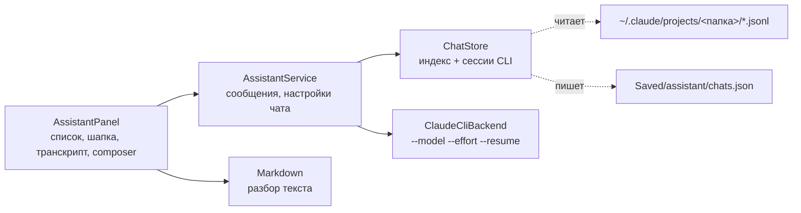

# AS3: ассистент v2 — чаты с историей, модель и effort, вложения, markdown

## Зачем это нужно

После AI1 и AI2 панель Assistant умела один разговор, а после «New chat» старый терялся. AS3 делает из неё нормальный чат:

- список чатов проекта слева, открытие старого чата с его транскриптом, продолжение в той же сессии CLI;
- модель и уровень размышлений у каждого чата, видимые в шапке;
- картинки и файлы к сообщению (скрепка, Ctrl+V, перетаскивание из Проводника и из Content Browser, `@`);
- ответы в markdown: заголовки, списки, жирный, инлайн-код, блоки кода с Copy, таблицы, ссылки; размышления свёрнуты.

Макеты и размеры — `.team/design/p2-spec.md` §2; здесь — как это устроено и как проверить.

## Как устроено



| Часть | Файл | За что отвечает |
| --- | --- | --- |
| `ChatStore` | [ChatStore.h](../../engine/include/myengine/assistant/ChatStore.h), [ChatStore.cpp](../../engine/src/assistant/ChatStore.cpp) | Список чатов, индекс `Saved/assistant/chats.json`, разбор `*.jsonl` в транскрипт |
| `AssistantService` | [AssistantService.h](../../engine/include/myengine/assistant/AssistantService.h) | Открытый чат, модель и effort, `OpenChat`, `RenameChat`, `HideChat`, `Retry` |
| `ClaudeCliBackend` | [ClaudeCliBackend.h](../../engine/include/myengine/assistant/ClaudeCliBackend.h) | Флаги `--model`, `--effort`, `--resume`, `--add-dir`; картинки как image block |
| `Markdown` | [Markdown.h](../../engine/include/myengine/assistant/Markdown.h) | Свой построчный разбор markdown, без внешних библиотек |
| Вид | [AssistantPanel.cpp](../../engine/src/ui/AssistantPanel.cpp), [AssistantMarkdownView.cpp](../../engine/src/ui/AssistantMarkdownView.cpp), [AssistantImages.cpp](../../engine/src/ui/AssistantImages.cpp) | Панель, отрисовка markdown, буфер обмена и миниатюры (GDI+) |
| Файлы из Проводника | [Window.cpp](../../engine/src/core/Window.cpp) | OLE drop target окна: перетаскивание файлов, состояние в `EditorRuntimeState::fileDrag` |

### История

Источник истины — сессии Claude Code CLI в `~/.claude/projects/<рабочая папка>/<session id>.jsonl`. Имя папки CLI получает из рабочей директории заменой каждого символа вне `[A-Za-z0-9]` на `-` (`C:\Users\me\game` → `C--Users-me-game`).

- В списке только чаты ассистента: у них в первой записи `entrypoint: "sdk-cli"` (так CLI помечает клиента SDK). Сессии, которые пользователь вёл в терминале или в приложении Claude в той же папке, не показываются, пока их не добавит индекс.
- Заголовок: переименование пользователя → `custom-title` CLI → первая строка первого сообщения.
- Индекс `Saved/assistant/chats.json` (папка `Saved/` в `.gitignore`) хранит то, чего нет в файлах CLI: свой заголовок, модель и effort чата, флаг «скрыт». «Hide from list» только ставит флаг; файлы CLI не трогаются.
- Метаданные берутся из начала файла (2 МБ) и его хвоста (128 КБ), результат кэшируется по размеру и времени файла. Сессии по 80 МБ в списке не тормозят.
- Открытие чата читает файл целиком (до 256 МБ), собирает User / Assistant / Thinking / Tool / Files / Summary и оставляет последние 500 сообщений. Продолжение идёт через `--resume <session id>`.

### Модель и effort

Проверено по `claude --help` и прогоном CLI 2.1.296:

| Что | Флаг | Значения |
| --- | --- | --- |
| Модель | `--model <alias или полное имя>` | `opus`, `sonnet`, `haiku` → `claude-opus-5-5`, `claude-sonnet-5-5`, `claude-haiku-5-5` (в `system/init` приходит фактическая) |
| Уровень размышлений | `--effort <level>` | `low`, `medium`, `high`, `xhigh`, `max`; неизвестное значение CLI игнорирует с предупреждением, поэтому панель передаёт только эти пять |

Модель и effort относятся к чату и применяются со следующего сообщения. Смена посреди чата работает: сессия продолжается через `--resume` с другими флагами, контекст сохраняется. В логе у каждого хода видно, с чем он запущен: `Assistant: started ... model=haiku effort=low attachments=0`. Пустое значение — настройка CLI по умолчанию.

### Вложения

| Что | Как уходит |
| --- | --- |
| Картинка png / jpg / webp / gif до 5 МБ | В stream-json как `{"type":"image","source":{"type":"base64",...}}` перед текстом сообщения |
| Любой другой файл | Строка `- <путь>` в конце текста («Attached files (open them with the Read tool)»); путь относительный, если файл внутри проекта; папку вне проекта передают как `--add-dir` |
| Картинка из буфера (Ctrl+V, «Paste from clipboard») | Сохраняется как `Saved/assistant/attachments/clipboard-<время>.png`, дальше как картинка |

Картинка больше 5 МБ или формата, который модель не принимает (bmp, tga, dds, tif...), показывается красным чипом с причиной в тултипе; отправка заблокирована, пока чип не убран. Чипы показывают миниатюру картинки (GDI+, 64 px) и имя. Максимум 12 вложений.

Источники вложений: скрепка (меню: «Pictures and files...» — стандартный диалог, «Paste from clipboard»), Ctrl+V в поле, перетаскивание файлов из Проводника (OLE: поверх панели рисуется рамка «Drop images or project files to attach»), перетаскивание плиток из Content Browser, кнопка `@` (поиск файла проекта по имени).

### Markdown

Разбор построчный, без зависимостей. Поддержано: `#`–`######`, абзацы, списки (вложенные, нумерованные, `[ ]` / `[x]`), цитаты, огороженный код с языком (незакрытая ограда считается кодом до конца: ответ ещё приходит), таблицы, горизонтальная черта; в строке — **жирный**, *курсив*, `код`, ~~зачёркнутое~~, `[ссылки](url)` и голые http(s)-адреса. Чего парсер не умеет, выводится текстом.

Отрисовка своя: перенос по словам со шрифтами Inter (обычный и SemiBold) и моно, фон инлайн-кода, у блока кода шапка с языком и кнопкой Copy (копирует ровно код), горизонтальная прокрутка. Ссылки открываются в браузере только для `http://` и `https://`.

### Транскрипт

- Сообщение пользователя — карточка, под текстом чипы вложений.
- Размышления — свёрнутая строка «Thought for N s»; клик раскрывает текст.
- Вызовы инструментов — компактные строки с кнопкой раскрытия diff (как в AI1).
- Подвал ответа: время, токены, длительность, модель (если не совпадает с выбранной), Copy (markdown ответа) и Retry (повторить последний запрос; только у последнего).
- Если пользователь прокрутил вверх, а пришёл новый текст, автопрокрутка не дёргает вид, а внизу появляется кнопка «New messages».

## Как проверить

```powershell
ctest --test-dir build -C Debug -R assistant --output-on-failure
```

Тест `assistant_chat` (`tests/assistant/ChatTests.cpp`): markdown (блоки, инлайн, поток), заголовки и имена, разбор транскрипта, `ChatStore` (список, фильтр по `sdk-cli`, индекс, hide, rename), сервис (настройки чата в запросе, открытие и `--resume`, Retry), командная строка и вложения (base64, `--add-dir`).

Вручную (нужен вход в `claude`):

1. `run.bat`, вкладка Assistant. Слева список чатов этого проекта.
2. В шапке выбрать модель Haiku и effort Low, отправить «Say OK». В логе `Assistant: started ... model=haiku effort=low`, в списке появился чат.
3. Скопировать картинку (например, Win+Shift+S), в поле Ctrl+V или скрепка → «Paste from clipboard»: появится чип с миниатюрой. Спросить «какого цвета картинка?» — модель отвечает по картинке.
4. Открыть старый чат из списка: показан его транскрипт; написать продолжение — сессия та же.
5. Строка чата → `...` → Rename (Enter сохраняет, Esc отменяет), Hide from list.
6. Сделать панель уже 720 px (перетащить границу): список уходит в выпадающее меню `history` в шапке.

## Что не вошло

- Подсветка синтаксиса в блоках кода.
- Тексты размышлений, которые CLI присылает в виде пустой строки с подписью (у новых моделей), не показываются: строка «Thought for N s» есть, раскрывать нечего.
- Вставка миниатюр картинок из старых сессий: в транскрипте старого сообщения картинка показана чипом «image» без превью (картинка лежит в файле сессии как base64).
- Прокрутка списка к открытому чату и переименование из шапки по двойному клику проверены только в коде.
