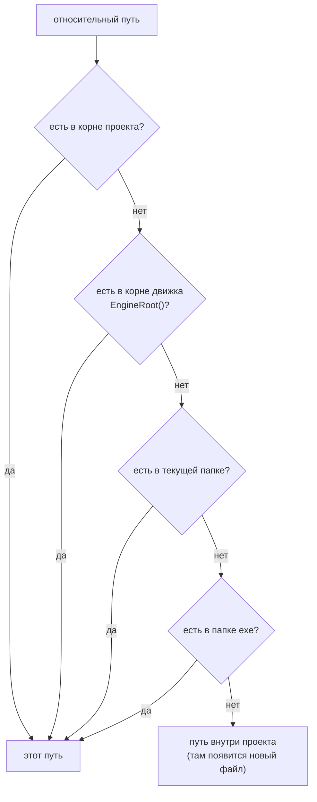
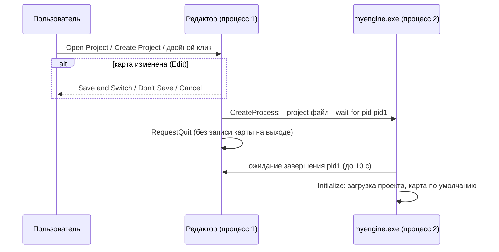

# P1: проекты (как в Unreal)

## Зачем это нужно

Раньше движок работал с одной папкой: `assets/` рядом с исходниками. Скрипты, prefab, карты и ресурсы лежали в ней же, а путь к ней был зашит в `MYENGINE_SOURCE_DIR`. P1 вводит понятие **проекта**: папка с файлом `<Name>.myproject`, внутри которой лежат свои карты, скрипты, prefab и ассеты. Редактор открывает один проект за процесс, умеет создавать новые, помнит недавние и открывает карты проекта через меню **File**. Движковый контент (шейдеры, шрифты, базовые материалы) остаётся в папке движка и доступен любому проекту.

Репозиторий сам является проектом по умолчанию: в корне лежит `myengine.myproject`, который описывает прежнюю раскладку `assets/`. Ассеты никуда не переносились, поэтому старые сцены и пути в них работают как раньше.

Чего в P1 **нет**:

| Чего нет | Комментарий |
| --- | --- |
| Смены проекта без перезапуска | Новый проект открывается новым процессом `myengine.exe`, старый завершается (см. ниже) |
| Импорта ассетов | Файлы кладутся в папки проекта руками |
| Упаковки (packaging) проекта | Собранной игры из проекта нет |
| Замены сцены под окном Project Browser | При `--project-browser` сцена проекта по умолчанию загружается под окном (см. ограничения) |

## Что сделано

| Что | Где | За что отвечает |
| --- | --- | --- |
| `ProjectDescriptor` | [ProjectContext.h](../../engine/include/myengine/core/ProjectContext.h) | Содержимое `.myproject`: имя, версия формата, папки, карта по умолчанию |
| `core::ProjectContext` | [ProjectContext.h](../../engine/include/myengine/core/ProjectContext.h), [ProjectContext.cpp](../../engine/src/core/ProjectContext.cpp) | Корень проекта, абсолютные пути папок, `ToProjectRelative`, `ResolveContentPath`; сервис `ServiceLocator::GetProjectContext()` |
| `core::project::*` | [ProjectContext.cpp](../../engine/src/core/ProjectContext.cpp) | Чтение и запись `.myproject`, `CreateProject`, `EmptyMapText`, список недавних, системные диалоги выбора файла и папки |
| Открытие проекта при старте | [Application.cpp](../../engine/src/core/Application.cpp) (`Initialize`) | `--project` / проект по умолчанию, скрипты и prefab из папок проекта, карта по умолчанию, запись в список недавних |
| Карты и смена проекта | [Application.cpp](../../engine/src/core/Application.cpp) (`OpenSceneFromDisk`, `SaveSceneAs`, `RestartWithProject`, `UpdateWindowTitles`) | Открытая карта как цель сохранения, перезапуск процесса, название окна |
| Аргументы командной строки | [main.cpp](../../app/src/main.cpp) | `--project`, `--scene`, `--play`, `--project-browser`, `--wait-for-pid` |
| File-меню, Project Browser, диалоги карт | [SceneEditorProject.cpp](../../engine/src/ui/editor/SceneEditorProject.cpp), [SceneEditorAssets.cpp](../../engine/src/ui/editor/SceneEditorAssets.cpp) | `New Map...`, `Open Map...`, `Save Map As...`, `Open Project...`, окно Project Browser, запрос о несохранённых изменениях |
| Корни Content Browser | [ContentBrowser.cpp](../../engine/src/ui/ContentBrowser.cpp), [SceneEditor.cpp](../../engine/src/ui/editor/SceneEditor.cpp) | `SetRoot(root, keyPrefix, visiblePaths)`, `SetRootLabel`, ключи ассетов внутри проекта |
| `ResourceManager::ResolvePath` и стабильные ключи | [ResourceManager.cpp](../../engine/src/resource/ResourceManager.cpp) | Поиск ассетов через проект; ключи считаются относительно корня проекта |
| Проект по умолчанию | [myengine.myproject](../../myengine.myproject) | Описание раскладки `assets/` |
| Тест `project_context` | [ProjectContextTests.cpp](../../tests/core/ProjectContextTests.cpp) | Автопроверка без окна и GPU |

## Файл проекта `<Name>.myproject`

JSON-файл в корне папки проекта. Корнем проекта считается папка, в которой лежит файл.

| Поле | Значение по умолчанию | Смысл |
| --- | --- | --- |
| `name` | имя файла без расширения | Имя проекта (в окне, Project Browser, названии окна) |
| `engineVersion` | `1` | Версия формата файла |
| `contentDir` | `"Content"` | Папка ассетов; корень Content Browser |
| `mapsDir` | `"Maps"` | Папка карт: `Open Map`, `New Map`, `Save Map As` |
| `scriptsDir` | `"Content/Scripts"` | Папка скриптов (hot reload, `sys.path`) |
| `prefabsDir` | `"Content/Prefabs"` | Папка prefab |
| `defaultMap` | `"Maps/Main.json"` | Карта, которая открывается при старте без `--scene` |

Все поля необязательны (при отсутствии берётся значение по умолчанию). Правила проверки (`project::ReadDescriptor`):

- пути папок и `defaultMap` относительны корня проекта; абсолютный путь (`C:/maps`, `/maps`) и выход за корень (`..` в любой части пути) отклоняются с сообщением `The project field '<поле>' must be a path inside the project`;
- `engineVersion` больше `1` отклоняется: `The project was made by a newer engine`;
- не-JSON, не объект, пустой файл и отсутствующий файл дают ошибку чтения; редактор в этом случае показывает окно с причиной и завершается;
- BOM в начале файла (UTF-8) допускается; пустое `name` заменяется именем файла.

Файл нового проекта (`MyGame.myproject`, создаётся Project Browser'ом):

```json
{
  "name": "MyGame",
  "engineVersion": 1,
  "contentDir": "Content",
  "mapsDir": "Maps",
  "scriptsDir": "Content/Scripts",
  "prefabsDir": "Content/Prefabs",
  "defaultMap": "Maps/Main.json"
}
```

Проект по умолчанию, `myengine.myproject` в корне репозитория:

```json
{
  "name": "myengine",
  "engineVersion": 1,
  "contentDir": "assets",
  "mapsDir": "assets/scenes",
  "scriptsDir": "assets/scripts",
  "prefabsDir": "assets/prefabs",
  "defaultMap": "assets/scenes/coin_guard_demo.json"
}
```

Если `myengine.myproject` рядом с исходниками не найден, `ProjectContext::InitializeDefault()` подставляет те же значения без файла на диске.

## `core::ProjectContext`

Один контекст на процесс, доступен как `core::ServiceLocator::GetProjectContext()`.

| Метод | Что возвращает |
| --- | --- |
| `Root()`, `ProjectFile()`, `Descriptor()`, `Name()` | Корень проекта, путь к `.myproject` (пусто для встроенного значения по умолчанию), поля файла, имя |
| `ContentDir()`, `MapsDir()`, `ScriptsDir()`, `PrefabsDir()`, `DefaultMap()` | Абсолютные пути (корень + поле файла, нормализованные) |
| `ToProjectRelative(path)` | Путь внутри проекта: `Maps/Main.json`; путь вне проекта остаётся абсолютным |
| `ResolveContentPath(path)` | Абсолютный путь к ассету по относительному (см. ниже) |
| `IsEngineProject()` | Корень проекта совпадает с корнем движка |
| `EngineRoot()` | `MYENGINE_SOURCE_DIR`, если там есть `assets/`, иначе папка exe |

### Порядок поиска `ResolveContentPath`



- Абсолютный путь только нормализуется, поиска нет.
- Корень движка пропускается, если он совпадает с корнем проекта.
- Несуществующий путь указывает внутрь проекта: так `Save Map As` и `New Map` создают файлы в папке проекта.
- Файл проекта побеждает одноимённый файл движка.

Благодаря запасному варианту через корень движка новый проект видит базовые материалы движка (`assets/materials/default.material.json`) и меш `assets/models/crate.obj`, на которые ссылается его первая карта. Шейдеры (`assets/shaders`) и шрифты (`assets/fonts`) проект не задаёт вовсе: они ищутся отдельным кодом рендера и UI в текущей папке, папке exe и `MYENGINE_SOURCE_DIR`, поэтому доступны любому проекту.

Через `ResolveContentPath` идут `ResourceManager::ResolvePath` и вычисление стабильных ключей ассетов (ключ — путь относительно корня проекта, затем корня движка и папки exe). Скрипты (hot reload) и prefab берутся из `scriptsDir` и `prefabsDir` проекта; если папки нет, остаётся копия рядом с exe (`assets/scripts`, `assets/prefabs`). Манифест `manifests/demo_assets.json` грузится из `contentDir` проекта, и только если файл есть.

## Запуск и аргументы

```text
myengine.exe [--project <файл.myproject>] [--scene <путь>] [--play] [--project-browser]
```

| Аргумент | Что делает |
| --- | --- |
| (без аргументов) | Проект по умолчанию: `myengine.myproject` рядом с исходниками, иначе встроенные значения с раскладкой `assets/` |
| `--project <файл.myproject>` | Открывает проект; успешно открытый проект попадает в список недавних |
| `--scene <путь>` | Карта: файл на диске или путь внутри проекта (`Maps/Second.json`); без аргумента открывается `defaultMap` |
| `--play` | Начать в режиме Play |
| `--project-browser` | Показать окно Project Browser поверх редактора |
| `--wait-for-pid <pid>` | Служебный: подождать (до 10 с) завершения процесса `<pid>`. Передаётся при смене проекта, вручную не нужен |

Каждый аргумент допускается один раз; неизвестный аргумент или аргумент без значения даёт окно с подсказкой по использованию и код выхода `-1`.

## Project Browser

Окно поверх редактора. Открывается через **File → Open Project...** или аргументом `--project-browser`.

| Элемент | Что делает |
| --- | --- |
| Current project | Имя и корень открытого проекта |
| Recent projects | До 10 последних проектов, новые первыми; двойной клик открывает проект. Список лежит в `%APPDATA%/myengine/recent_projects.json`, файлы, которых уже нет, не показываются |
| **Open Project...** | Системный диалог выбора `.myproject` |
| **New project** | Поля **Name** (по умолчанию `NewProject`) и **Folder** (по умолчанию `%USERPROFILE%\Documents\myengine projects`, кнопка **Browse...** открывает диалог папки), кнопка **Create Project** |
| **Close** | Закрыть окно |

**Create Project** создаёт `<папка>/<Name>/`:

```text
<Name>/
  <Name>.myproject
  Content/
    Scripts/  Prefabs/  Materials/  Models/  Textures/
  Maps/
    Main.json        # камера и пол
```

Имя проекта не пустое, до 64 символов, без `\ / : * ? " < > |`, без пробела в начале и в конце и без точки в конце. Если папка `<папка>/<Name>` уже существует и не пуста, проект не создаётся (ошибка показывается красным текстом в окне). Первая карта `Main.json` — две сущности: камера `Camera_1` с `CameraController` и пол `Floor_1` (`MeshRenderer` с `assets/models/crate.obj`, растянутый `Transform`, `Collider`).

### Смена проекта

Проект меняется только перезапуском процесса.



- `RestartWithProject` запускает тот же exe с `--project <файл> --wait-for-pid <pid>` и вызывает `RequestQuit`. Если процесс не удалось создать, редактор остаётся открытым, в лог пишется ошибка.
- Если карта не изменена (или режим Play), диалога нет. Если изменена, спрашивается: **Save and Switch** (сохранить текущую карту и перейти), **Don't Save**, **Cancel**.
- Запись карты на выходе при смене проекта отключена (`discardSceneOnExit_`): карта либо уже сохранена, либо сброшена сознательно.
- Новый процесс ждёт старый, потому что файл лога, класс окна и GPU у них общие.

## Карты

Карта — это файл сцены (`.json`) в `mapsDir` проекта. Пункты меню доступны только в режиме Edit.

| Пункт File | Что делает |
| --- | --- |
| **New Map...** | Диалог с именем (по умолчанию `NewMap`). **Create** записывает пустую карту (камера и пол) в `mapsDir` и открывает её. Если файл с таким именем уже есть, показывается `A map with this name already exists.` |
| **Open Map...** | Список всех `*.json` внутри `mapsDir` (рекурсивно), двойной клик открывает; открытая карта подсвечена. Если карта изменена, перед открытием спрашивается о сохранении |
| **Save Map As...** | Диалог с именем (по умолчанию имя открытой карты). **Save** записывает мир в `<mapsDir>/<имя>.json`; если файл существует, кнопка меняется на **Overwrite**. Сохранение под именем открытой карты подтверждения не требует |
| **Open Project...** | Открывает Project Browser |

Под полем имени диалог показывает итоговый ключ карты (например `Maps/Second.json`). Имя карты проверяется теми же правилами, что и имя проекта.

Открытая карта становится целью **Save Scene** и сохранения при выходе из редактора (`Application::Shutdown`): `sceneSavePath_` переключается при `OpenSceneFromDisk` и `SaveSceneAs`. Путь карты внутри проекта хранится в `EditorRuntimeState::mapPath`.

Название окна: `<заголовок окна> | <Проект> — <Карта>`, затем, как раньше, метка состояния (например `[Play]`).

## Content Browser

Корень зависит от раскладки проекта:

| Раскладка | Корень | Ключи ассетов |
| --- | --- | --- |
| `mapsDir` внутри `contentDir` (проект по умолчанию: `assets` и `assets/scenes`) | `contentDir`, узел `Content` | Префикс — путь `contentDir` внутри проекта: `assets/models/crate.obj` |
| `mapsDir` вне `contentDir` (новый проект: `Content` и `Maps`) | Корень проекта с именем проекта; видны только два узла, `Content` и `Maps` | Пути внутри проекта: `Content/Models/a.obj`, `Maps/Main.json` |

- В корне проекта показываются только `Content` и `Maps`; остальное (например, `.git`) нет.
- Браузер повторяет диск: видны все папки и все файлы. Не показываются только служебные: папки `.git`, `Saved` и любые с точки, файлы с точки и кэши ресурсов `*.myemesh`, `*.myetex`. Неизвестный тип файла показывается как `File`.
- `.json` внутри папки `scenes` или `Maps` на любой глубине считается картой (двойной клик открывает её), остальные `.json` — обычные файлы.
- Ключ ассета — тот же путь, который записывается в сцены и prefab (`meshPath`, `materialPath`), поэтому ключи не зависят от расположения проекта на диске.
- Изменения на диске подхватываются сами: при возвращении фокуса, раз в секунду по времени записи текущей папки и кнопкой **Refresh**.

### Вид

| Элемент | Что делает |
| --- | --- |
| Tiles / List | Плитки или таблица Name / Type / Size / Modified; клик по заголовку колонки сортирует |
| Sort | Name, Type, Size, Modified, направление ▲/▼; папки сверху, если включено **Folders first** |
| View Options | Вид, размер плиток 72–160 (шаг 8), ключ и направление сортировки, Folders first |
| Поиск | Фильтр по имени в текущей папке и ниже |

- Все плитки одного размера: квадрат-миниатюра, полоса цвета типа, имя в 2 строки (с `…`), тип. У папок та же ячейка без карточки. Полное имя, размер, путь и размер картинки — в тултипе.
- Миниатюры: у текстур сама картинка (`ImGui::Image`, с шахматкой под прозрачными пикселями, у совсем маленьких — плашка с размером), у материалов, мешей и префабов — картинка из `editor::ThumbnailService` ([thumbnails.md](thumbnails.md)): сфера с материалом, меш по границам, меши префаба. Карты, скрипты и шейдеры показывают иконку типа. Пока картинка готовится (текстуры грузятся в фоне, сервис рисует по 2 в кадр), на плитке бегущая полоса, а в подвале «Generating thumbnails… N». Ассет, который сервис не смог нарисовать, остаётся с иконкой.
- Двойной клик и пункт **Open** идут через `ContentBrowserHooks::onOpenAsset(assetPath, kind)`: редактор отвечает `true`, если открыл ассет сам (карта, prefab, материал), иначе браузер использует прежние колбэки `openScene` / `openPrefab` / `openMaterial` (для скрипта — внешний редактор). Просмотрщики ассетов подключаются в `onOpenAsset`.
- Картинку для плитки отдаёт `ContentBrowserHooks::thumbnail(entry, pixelSize)`: браузер спрашивает только про видимые плитки, не больше трёх новых в кадр. Ответ хранится, пока не изменится время записи файла или размер; ответы с `live` (картинки сервиса: он вытесняет и переиспользует цели) и `pending` запрашиваются заново каждый кадр. Размер плитки идёт в сервис как есть (он округляет до 64 / 128 / 256), в List запрашивается 64.
- Контекстное меню: Open, Show in Explorer, Copy Path, Copy Full Path.

## Как создать скрипт в проекте

1. Положить файл `<имя>.py` в `scriptsDir` проекта: `Content/Scripts` для нового проекта, `assets/scripts` для проекта по умолчанию.
2. Папка скриптов проекта добавлена в `sys.path`, поэтому модуль импортируется по имени файла (без пути).
3. Hot reload работает как раньше ([T5](../scripting/t5-hot-reload.md)): сохранение файла подхватывается без перезапуска. Читаются файлы из `scriptsDir` проекта, а не копия рядом с exe (она нужна только как запасной вариант, если папки проекта нет).

Prefab лежат в `prefabsDir` и подхватываются так же ([T4](../scripting/t4-prefabs.md)).

## Как проверить

1. **Проект по умолчанию.** Запустить `run.bat`: в названии окна `| myengine — coin_guard_demo`, в Content Browser корень `Content` с `assets/...`, скрипты и сцена работают как раньше.
2. **Создание проекта.** File → Open Project..., в **New project** ввести имя и нажать **Create Project**. Открывается новое окно редактора, в названии `| <Имя> — Main`; на диске появилась структура из раздела выше; в Content Browser узлы `Content` и `Maps`.
3. **Скрипт и карта в новом проекте.** Положить `.py` в `Content/Scripts`, добавить его на объект: hot reload срабатывает. File → New Map... → `Second` (карта открывается, в названии `— Second`), изменить что-нибудь, File → Save Scene, затем File → Open Map... и выбрать `Maps/Main.json`.
4. **Смена проекта с изменённой картой.** Передвинуть любой объект, File → Open Project... и выбрать другой проект: появляется запрос **Save and Switch / Don't Save / Cancel**. **Cancel** возвращает в редактор, остальные варианты открывают новый процесс.
5. **Запуск из командной строки.** `myengine.exe --project <путь к .myproject> --scene Maps/Second.json`: открывается указанная карта; `myengine.exe --project-browser` показывает Project Browser поверх редактора.

### Автотест

```powershell
ctest --test-dir build -C Debug -R project_context --output-on-failure
```

Тест `project_context` (цель `myengine_project_tests`, таймаут 30 с) не создаёт окна и не использует GPU. Проверяет:

| Этап | Что проверяет |
| --- | --- |
| `TestDescriptor` | Минимальный файл (с BOM) и значения по умолчанию; имя из имени файла; запись и чтение туда-обратно; отказ для `..`, абсолютного пути, `engineVersion` 99, битого JSON и отсутствующего файла |
| `TestCreateAndContext` | `CreateProject`: отказ для имени со слешем, несуществующей папки и непустой существующей; папки и первая карта (камера и пол); `Load`, пути, `ToProjectRelative` |
| `TestResolveContentPath` | Файл проекта побеждает файл движка; запасной вариант через корень движка; несуществующий путь указывает внутрь проекта; абсолютный путь не меняется |
| `TestEngineProjectFile` | `myengine.myproject` лежит в корне движка и грузится, `IsEngineProject`, папки существуют; встроенное значение по умолчанию совпадает с файлом |
| `TestRecentProjects` | Порядок «новые первыми», без дублей, обрезка до заданного числа, битый список читается как пустой |

Автотест не проверяет окна (Project Browser, диалоги карт, запрос о сохранении), перезапуск процесса, Content Browser с двумя узлами и разбор аргументов командной строки: это ручные шаги выше.

## Ограничения

- **Смена проекта = перезапуск процесса.** Состояние, не записанное в карту, теряется; Play-режим и открытые окна не переносятся.
- **Project Browser не заменяет сцену.** С `--project-browser` сцена проекта по умолчанию загружается под окном; окно закрывается кнопкой **Close**.
- **Запись карты на выходе.** При обычном завершении редактор записывает текущую карту (`sceneSavePath_`), как и раньше; отключается только при смене проекта.
- **Нет импорта ассетов и упаковки.** Файлы кладутся в `Content/*` проекта вручную; Content Browser подхватывает их кнопкой **Refresh** или при возврате фокуса в окно.
- **Проект один за процесс.** Два проекта одновременно можно открыть только двумя процессами.
- **Только Windows.** Диалоги выбора файла и папки (`IFileOpenDialog`) и запуск процесса используют Win32.
