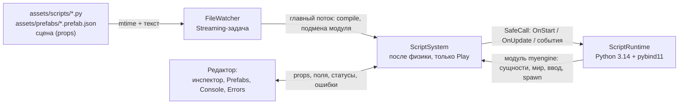

# ЛР2: скриптинг на Python (обзор)

В движок встроен Python 3.14: поведение сущностей пишется на Python-классах, правится прямо во время игры, а баланс лежит в данных сцены и prefab. На этом построена игра «Сбор монет под охраной». Работа разделена на задачи T0–T9 и допфичи D*; план и архитектурные решения — в [architecture.md](architecture.md), здесь собраны итоги и ссылки на документ по каждой задаче.

## Что сделано

| Требование ЛР2 | Что получилось | Подробнее |
| --- | --- | --- |
| Скриптовая подсистема: явная инициализация и остановка интерпретатора, единая точка загрузки, понятное время жизни, поставка рантайма | Python 3.14.6 и pybind11 3.1.0 лежат в репозитории (`external/`), интерпретатор запускается в изолированном режиме с путями в `wchar_t`, останавливается по строгому порядку; все импорты идут через одну функцию | [T0](t0-runtime.md) |
| Двусторонние bindings без висячих ссылок | Движок → скрипт: класс `Behaviour` и trampoline (`OnStart`, `OnUpdate`, `OnCollision`, `OnTrigger`, `OnDestroy`, `OnReload`). Скрипт → движок: сущности и компоненты, ввод, спавн и удаление, запросы к миру, плюс время, HUD, сообщения между скриптами. Сущность в Python — это id с проверкой «жива ли» | [T2](t2-api.md), [T3](t3-lifecycle.md) |
| Hot reload | Минимум: изменение файла подхватывается автоматически, опрос файлов выполняет `Streaming`-пул job system; ошибка в новой версии не трогает старую. Допфича: перезагрузка прямо в Play с переносом состояния | [T5 + D3](t5-hot-reload.md), [D1](d1-play-reload.md) |
| Одна механика целиком на скриптах | Раунд с монетами, врагами, таймером, победой и салютом: логика, состояние и реакция на события в `assets/scripts/*.py` | [T6](t6-gameplay.md) |
| Prefab в JSON, включая поля скриптов | Шаблоны `coin`, `chaser`, `firework`; спавн одной командой `me.world.spawn("coin", pos)` | [T1](t1-serialization.md), [T4](t4-prefabs.md) |
| Правка полей поведения в редакторе | Панель Script в инспекторе (с undo), панель Prefabs для шаблонов | [T7](t7-script-inspector.md), [T8](t8-prefab-editor.md) |
| Стабильность | Сломанный скрипт отключает только свой экземпляр (`Faulted`), в лог идёт `файл:строка` и traceback, список ошибок виден в редакторе. Серия сценариев на устойчивость (T9) — в работе | [T3](t3-lifecycle.md), [D6](d6-console.md), [T9](../measurements/lab2/t9-stability.md) (в работе) |
| Допфичи | Профилирование скриптов в Tracy, REPL-консоль с вкладкой ошибок, hot reload в Play, hot reload через job system | [D4](d4-profiling.md), [D6](d6-console.md), [D1](d1-play-reload.md), [T5 + D3](t5-hot-reload.md) |

Допфичи, которых нет: D2, D5, D7–D12 из списка в [architecture.md](architecture.md) в план реализации не включались. Известное ограничение: бесконечный цикл в скрипте (`while True: pass`) повесит главный поток; защита по времени (D10) не делалась.

## Задачи

A — Артём, B — Иван.

| Задача | Содержание | Кто | PR / коммит | Документ |
| --- | --- | --- | --- | --- |
| T0 | Каркас: Python и pybind11 в сборке, `ScriptRuntime`, `print` в лог | A | [#18](https://github.com/DvornikovArtem/myengine/pull/18) | [t0-runtime.md](t0-runtime.md) |
| T1 | Сериализация `ScriptComponent`, `props`, `--scene`, `SceneLoadedEvent` | B | [#19](https://github.com/DvornikovArtem/myengine/pull/19) | [t1-serialization.md](t1-serialization.md) |
| T2 | API «скрипт → движок»: компоненты, мир, ввод, время, `send`, HUD | B | [#24](https://github.com/DvornikovArtem/myengine/pull/24) | [t2-api.md](t2-api.md) |
| T3 | `Behaviour`, жизненный цикл, события, отложенное удаление, `SafeCall` / `Faulted` | A | [#20](https://github.com/DvornikovArtem/myengine/pull/20) | [t3-lifecycle.md](t3-lifecycle.md) |
| T4 | Prefab: библиотека шаблонов, `world.spawn` | B | [#25](https://github.com/DvornikovArtem/myengine/pull/25) | [t4-prefabs.md](t4-prefabs.md) |
| T5 + D3 | Hot reload, `FileWatcher` на `Streaming`-пуле, F5, `DescribeFields` | A | [#21](https://github.com/DvornikovArtem/myengine/pull/21) | [t5-hot-reload.md](t5-hot-reload.md) |
| D1 | Hot reload в Play: L1 / L2, `OnReload`, оживление `Faulted` | A | [#22](https://github.com/DvornikovArtem/myengine/pull/22) | [d1-play-reload.md](d1-play-reload.md) |
| D4 | Зоны Tracy на вызовы скриптов, бакет `scripts` в Statistics | B | [#26](https://github.com/DvornikovArtem/myengine/pull/26) | [d4-profiling.md](d4-profiling.md) |
| T6 | Игра «Сбор монет под охраной» | B | [#27](https://github.com/DvornikovArtem/myengine/pull/27) | [t6-gameplay.md](t6-gameplay.md) |
| T7 | Панель Script в инспекторе | A | [#23](https://github.com/DvornikovArtem/myengine/pull/23) | [t7-script-inspector.md](t7-script-inspector.md) |
| T8 | Панель Prefabs | B | [#28](https://github.com/DvornikovArtem/myengine/pull/28) | [t8-prefab-editor.md](t8-prefab-editor.md) |
| D6 | REPL-консоль и вкладка Errors | B (код), доводка A | коммиты `dace18d`, `907233b` (PR [#29](https://github.com/DvornikovArtem/myengine/pull/29) закрыт, заменён) | [d6-console.md](d6-console.md) |
| E1 | Старт в Edit, `--play`, индикатор режима, сцена по умолчанию (вне плана) | A | коммит `907233b` | [e1-edit-mode.md](e1-edit-mode.md) |
| T9 | Сценарии стабильности в Debug и RelWithDebInfo | A + B | в работе | [t9-stability.md](../measurements/lab2/t9-stability.md) (в работе) |

## Как устроено, в одной картинке



Python вызывается только с главного потока. Job system участвует там, где Python не нужен: опрос и чтение файлов (D3).

## Как запустить демо

Нужны Windows 10/11 и Visual Studio с C++; установленный Python не требуется.

```powershell
.\setup.bat
.\build.bat Debug
.\run.bat
```

(`RelWithDebInfo` вместо `Debug` — для замеров в Tracy; `run.bat RelWithDebInfo` запускает эту конфигурацию.)

`run.bat` открывает `assets/scenes/coin_guard_demo.json` в режиме **Edit**: плашка `EDIT`, скрипты и физика стоят ([E1](e1-edit-mode.md)).

1. **Edit.** В иерархии выбрать `GameManager`, `CoinSpawner` или `EnemySpawner`: в инспекторе панель Script с полями (например, `target_score`). Серые значения — по умолчанию из кода; правка записывает значение в сцену, Reset убирает его, Ctrl+Z отменяет ([T7](t7-script-inspector.md)). Шаблоны монеты и врага правятся в панели Prefabs ([T8](t8-prefab-editor.md)).
2. **Play.** Нажать Play: плашка `PLAYING`, зелёная рамка вьюпорта. Управление: WASD — игрок, Space — прыжок, R — новый раунд; камера — как в движке. Цель — 10 очков за 60 секунд, враги появляются через 4 секунды ([T6](t6-gameplay.md)). Статистика скриптов — в окне Statistics.
3. **Консоль.** View → Script Console (по умолчанию открыта внизу). В Play: `me.world.find("Controlled_1").transform.position`, `me.world.spawn("coin", me.Vec3(0, 0.5, 0))`. Вкладка Errors собирает ошибки скриптов ([D6](d6-console.md)).
4. **Hot reload.** Не останавливая игру, в `assets/scripts/coin.py` заменить `self.score_value` в `me.send(...)` на `self.score_value * 2` и сохранить (или F5): следующие монеты дают двойные очки, счёт и таймер не сбросились ([D1](d1-play-reload.md)). Флажок **Keep script state** переключает перенос состояния (L2) и перезапуск объектов (L1). Чтобы показать защиту от ошибок, удалить двоеточие у `def` и сохранить: в логе и во вкладке Errors появится `coin.py:<строка>: SyntaxError`, игра продолжит работать на старом коде ([T5](t5-hot-reload.md)). После показа вернуть исходные строки.
5. **Stop** возвращает сцену к состоянию до Play.

Запуск других сцен и режимов: `myengine.exe --scene <путь>`; `--play` стартует сразу в Play. Замеры ЛР1: `myengine.exe --scene assets/scenes/benchmark.json --play`.

Скрипты, prefab и сцены читаются из исходников (`assets/`), поэтому правки видны сразу; при выходе приложение сохраняет открытую сцену в её файл.

## Тесты

```powershell
ctest --test-dir build -C Debug --output-on-failure
```

В CTest 8 тестов: `job_system_stress`, `scene_serialization`, `control_systems`, `script_api`, `prefab_library`, `scripting_gameplay`, `prefab_inspector`, `script_console`. Оконные smoke-тесты (`myengine_gameplay_smoke`, `myengine_scripting_smoke`) запускаются отдельно и в CTest не входят. По состоянию на последнюю доводку (D6 + E1) coder-1 сообщил 8 из 8 в Debug и RelWithDebInfo, оба smoke-теста прошли.

## Замеры и логи

В [docs/measurements/lab2](../measurements/lab2/README.md):

- [README замеров](../measurements/lab2/README.md) — D4: Tracy-трейс `d4_1.tracy` и CSV по зонам `Scripts::`, как повторить запись;
- [t6_1.tracy](../measurements/lab2/traces/ivan/t6_1.tracy) — трейс оконного теста игры T6 (техническая проверка, не бенчмарк);
- [логи CTest и smoke-тестов T6 и T8](../measurements/lab2/tests/ivan/) — по Debug и RelWithDebInfo;
- [t9-stability.md](../measurements/lab2/t9-stability.md) — протокол сценариев стабильности, в работе (логи Артёма появятся в `tests/artem/`).

Для T0, T3, T5, D1, T7, D6 и E1 отдельных логов сборки в репозитории нет; в каждом документе указано, что именно и чем проверено.

## Порядок чтения

1. [architecture.md](architecture.md) — идея, потоки, время жизни состояния, план.
2. T0 → T3 → T5 / D1 — как Python встроен и как скрипты живут и перезагружаются.
3. T2 → T4 → T6 — что скрипты умеют и как написана игра.
4. T7 → T8 → D6 → E1 — редактор и демо.
5. D4 и замеры — профилирование.

## Git

Базовая ветка лабы — `feature/scripting`; каждая задача — своя ветка `scripting/<id>-<slug>` и PR обратно в неё.
