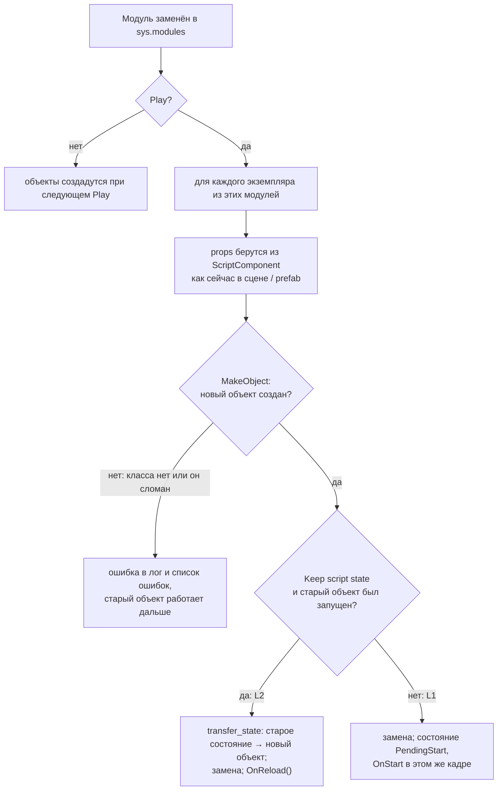

# D1: горячая перезагрузка в Play

## Зачем это нужно

T5 научила движок подхватывать изменённый код, но уже запущенные объекты продолжали жить на старом классе до следующего Stop → Play. D1 закрывает этот разрыв: правка скрипта работает **в запущенной игре**. Счёт, таймер раунда и положение объектов не сбрасываются, а правило (условие, формула, число) меняется на лету. Это допфича ЛР2 и главный эффект для живого демо.

PR [#22](https://github.com/DvornikovArtem/myengine/pull/22) `scripting/d1-play-reload`, влит 08.10.2026.

## Что сделано

| Что | Где | За что отвечает |
| --- | --- | --- |
| `ScriptSystem::ReloadInstances` | [ScriptSystem.cpp](../../engine/src/scripting/ScriptSystem.cpp) | Замена запущенных объектов объектами новых классов |
| `MakeObject` | [ScriptSystem.cpp](../../engine/src/scripting/ScriptSystem.cpp) | Общий путь создания: модуль → класс → `cls()` → `entity` → `props` (тот же, что при появлении сущности) |
| `transfer_state` | [ScriptHelpers.cpp](../../engine/src/scripting/ScriptHelpers.cpp) | Перенос состояния старого объекта в новый (L2) |
| `scriptReloadKeepsState` | [EditorState.h](../../engine/include/myengine/editor/EditorState.h) | Режим L2 (по умолчанию) или L1 |
| Флажок **Keep script state** | [SceneEditor.cpp](../../engine/src/ui/SceneEditor.cpp) | Переключатель режима в тулбаре вьюпорта |

Подсказка из T5 («Stop → Play перезапускает работающие объекты») убрана: теперь перезапуск не нужен.

## Два режима

| Режим | Что происходит с запущенным объектом | Когда включать |
| --- | --- | --- |
| **L2** (флажок включён, по умолчанию) | Создаётся объект нового класса, в него переносится всё состояние старого, вызывается `OnReload()`; `OnStart` не вызывается | Основной режим: правим правило и игра идёт дальше |
| **L1** (флажок выключен) | Создаётся объект нового класса, `OnStart` выполняется заново; состояние начинается с нуля | Нужно «как после Play», но без остановки игры |

## Как проходит перезагрузка

Перезагрузка выполняется на шаге 0 кадра (`ProcessFileChanges`), сразу после замены модуля в `sys.modules`, в режиме Play. Затронутыми считаются объекты, чей модуль был перезагружен (в том числе новый файл, который удалось скомпилировать: скрипт, упавший с «No module named ...», оживает, когда файл появился).



Детали:

- Старый Python-объект отпускается без `OnDestroy`. Ссылки на **сущности** (`Entity`) остаются рабочими: горячая перезагрузка не меняет версию сцены, а `Entity` — это id с проверкой «жива ли».
- Если новый код не создаётся (класс удалён или переименован, ошибка в конструкторе), старый объект остаётся и продолжает работать на прежнем коде; ошибка видна в логе и во вкладке Errors консоли ([D6](d6-console.md)).
- `Faulted`-объект после перезагрузки своего файла **оживает**: его заменяет новый. В L2 (если старый успел запуститься) это `Active` с перенесённым состоянием и `OnReload`, в L1 или если старый объект так и не был создан — `PendingStart` с обычным `OnStart`.
- Перезагрузка всех скриптов (F5, кнопка Reload scripts, перезагрузка модуля-помощника из [T5](t5-hot-reload.md)) пересоздаёт все запущенные объекты.
- Ссылки на **объекты поведений**, сохранённые другими скриптами (например, `self.manager = ...get_script(GameManager)`), продолжают указывать на старый объект. Надёжнее получать поведение через `entity.get_script(...)` в момент использования и импортировать класс внутри метода, как сделано в скриптах T6.

## Перенос состояния (L2)

`transfer_state(old, new)` копирует в новый объект всё из `vars(old)`: счётчики, таймеры, ссылки на сущности и любые атрибуты, заведённые в `OnStart` (например, `self.collected`), **кроме полей, у которых значение по умолчанию в коде изменилось**. Для таких полей остаётся значение, с которым создан новый объект: `props` из сцены или prefab, а если их нет — новое значение по умолчанию из кода. Сравниваются значения атрибутов старого и нового класса у полей, объявленных в обоих.

Пример: у `Chaser` в коде `speed: float = 3.0`, но в `chaser.prefab.json` записан `"speed": 3.0`. Если поменять значение по умолчанию на `8.0`, враги из этого prefab **не ускорятся**: `props` приоритетнее кода. Чтобы враги побежали быстрее, меняют число в prefab (панель Prefabs, [T8](t8-prefab-editor.md)) или правило в `OnUpdate`. Значение по умолчанию заметно у тех объектов, у которых поле не записано в данных.

После замены в лог пишется итог, например:

```text
ScriptSystem: hot reload in Play: 6 object(s) kept their state, 0 restarted, 0 kept the old code; fields with a new default: speed
```

(формат строки взят из кода; числа в примере иллюстративные). Здесь «kept the old code» — объекты, для которых новый не удалось создать.

## Демонстрация

Правило из T6: в `assets/scripts/coin.py` строку

```python
me.send(self.manager_name, "add_score", self.score_value)
```

заменить на

```python
me.send(self.manager_name, "add_score", self.score_value * 2)
```

и сохранить файл (или нажать F5) прямо в Play. Счёт и таймер не сбросятся, а следующие подобранные монеты дадут двойные очки. После показа вернуть исходную строку. Подробнее про механику — в [T6](t6-gameplay.md).

## Проверка

- Автотест `script_api` ([ScriptApiTests.cpp](../../tests/scripting/ScriptApiTests.cpp), `TestHotReloadAndFields`): L2 — новый объект отличается от старого, `state` (заведённый в `OnStart`) перенесён, `speed` взято из нового кода (8.0), `OnReload` вызван один раз, счётчик тиков не откатился, `entity.alive` остаётся истиной; ошибка синтаксиса оставляет рабочим старый модуль и объект `Active`; L1 (флажок выключен) — состояние сбрасывается и `OnStart` выполняется снова (`state == 42`, `reloads == 0`); после Stop экземпляров 0.
- Автотест `scripting_gameplay` ([GameplayTests.cpp](../../tests/scripting/GameplayTests.cpp)): перезагрузка L1/L2 на механике T6 с изменением правила и 5 циклов Play/Stop.
- Сохранённые прогоны: [T8, Debug](../measurements/lab2/tests/ivan/t8_debug_ctest.log), [T8, RelWithDebInfo](../measurements/lab2/tests/ivan/t8_relwithdebinfo_ctest.log) — CTest 7 из 7. Отдельных логов для PR #22 не сохранялось.
- Устойчивость при серии перезагрузок, `Faulted`-скриптах и длинной сессии проверяет T9 — она в работе.
