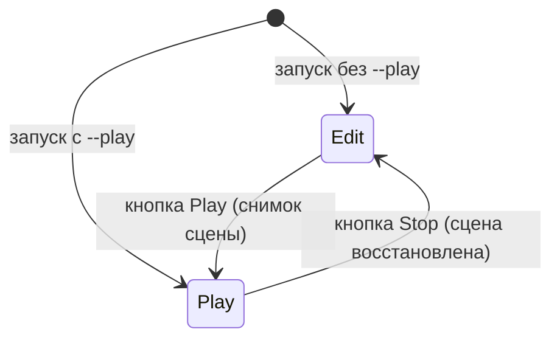

# E1: старт в Edit, индикатор режима и сцена по умолчанию

## Зачем это нужно

E1 не входит в план ЛР2 (`architecture.md`): это доработка для живого демо. Раньше приложение сразу стартовало в Play (так, после подключения Tracy и benchmark-сцены, удобно запускать замеры ЛР1), поэтому на демо сцена уже «жила», а режим читался только по серой надписи в тулбаре. Теперь:

- движок стартует в **Edit**: скрипты и физика стоят, монеты не двигаются, можно показать иерархию и инспектор;
- по одному взгляду на окно видно, в каком режиме находится игра;
- без аргументов открывается демо-сцена `coin_guard_demo.json`, а не benchmark.

Изменения лежат в коммите `907233b` (вместе с доводкой [D6](d6-console.md)).

## Что сделано

| Что | Где | За что отвечает |
| --- | --- | --- |
| Параметр `startInPlay` | [Application.h](../../engine/include/myengine/core/Application.h), [Application.cpp](../../engine/src/core/Application.cpp) | `Initialize(config, scenePath, startInPlay = false)` |
| Флаг `--play` | [main.cpp](../../app/src/main.cpp) | Разбор аргументов командной строки, текст Usage |
| Плашка режима, рамка вьюпорта, блокировка кнопок | [SceneEditor.cpp](../../engine/src/ui/SceneEditor.cpp) | Индикатор в тулбаре |
| Метка `[PLAY]` в заголовке окна | `Application::UpdateWindowTitles` | Режим виден и в заголовке, и на панели задач |
| Сцена по умолчанию | `kDefaultScenePath` в `Application.cpp` | `assets/scenes/coin_guard_demo.json` |
| Smoke-тесты | [GameplaySceneSmoke.cpp](../../tests/scene/GameplaySceneSmoke.cpp), [ScriptingSceneSmoke.cpp](../../tests/scene/ScriptingSceneSmoke.cpp) | Передают `startInPlay = true`, чтобы проверять то же, что раньше |

## Режим при старте

| Запуск | Режим | Что происходит |
| --- | --- | --- |
| `myengine.exe` | Edit | Снимок Play пуст, физика на паузе, выделение сброшено, скрипты не работают |
| `myengine.exe --play` | Play | Как раньше: снимок сцены, Play, физика идёт |

Аргументы можно сочетать: `myengine.exe --scene <путь> --play`. Повторный `--play`, неизвестный аргумент или `--scene` без пути показывают окно с текстом `Usage: myengine.exe [--scene <path>] [--play]` и завершают запуск.

Замеры ЛР1 запускаются теперь так (benchmark остался доступен):

```powershell
.\myengine.exe --scene assets/scenes/benchmark.json --play
```

Stop после старта в Edit и выход из Edit работают без изменений: сцена сохраняется в загруженный файл, как и раньше.

## Индикатор режима



- **Плашка** в тулбаре вьюпорта: `EDIT` на спокойном серо-синем фоне, `PLAYING` на зелёном.
- **Рамка** вьюпорта шириной 3 px того же зелёного цвета, только в Play; в Edit рамки нет.
- **Кнопки**: Play неактивна вне Edit, Stop неактивна в Edit. Логика нажатий не менялась.
- **Заголовок окна**: `<базовый заголовок> [<состояние>]`, а в Play дополнительно ` [PLAY]`, например `myengine - main [Gameplay] [PLAY]`. Заголовок обновляется при смене состояния приложения и при смене режима, `HWND` для этого никуда не передавался.

## Сцена по умолчанию

Без `--scene` открывается `assets/scenes/coin_guard_demo.json` (игра из [T6](t6-gameplay.md)). `run.bat` не передаёт аргументов, поэтому он открывает эту сцену в Edit: дальше Play, консоль ([D6](d6-console.md)) и горячая перезагрузка ([T5](t5-hot-reload.md), [D1](d1-play-reload.md)) показываются на ней.

Приложение при выходе сохраняет текущую сцену обратно в её файл (в канонической форме сериализатора). По отчёту проверки выход из Edit без правок оставил копию `coin_guard_demo.json` побайтно прежней (5294 байта, SHA-256 начинается с `CC9753AA`), а Play в сцену не «протекает»: содержимое после запуска без флагов и с `--play` одинаково. В `907233b` вошла версия `coin_guard_demo.json`, в которой отличаются только поля камеры: `position`, `rotationDeg` (в `Camera`) и `moveSpeed` (в `CameraController`).

## Проверка

По отчёту coder-1 (карточка `.team/tasks/e1.md`, рабочее дерево ветки `scripting/d6-console-finish`, логи в репозиторий не сохранялись):

- `Debug` и `RelWithDebInfo` собираются без ошибок и предупреждений компилятора (в Debug остаётся известный шум LNK4099 про PDB сторонних библиотек);
- `ctest` — 8 из 8 в обеих конфигурациях;
- `myengine_gameplay_smoke` и `myengine_scripting_smoke` (оконные, в CTest не входят) запущены вручную в обеих конфигурациях: OK;
- запуск настоящего exe на копии сцены: без флагов заголовок без `[PLAY]`, с `--play` — с `[PLAY]`; окно закрывается с кодом 0; `--bogus` показывает Usage; ошибок в `myengine.log` нет.

Что смотрит человек в окне (ручная проверка из карточки):

1. `run.bat`: открылось в Edit, плашка `EDIT`, Play активна, Stop серая, рамки нет, монеты и скрипты стоят, в заголовке нет `[PLAY]`.
2. Play: плашка `PLAYING` зелёная, зелёная рамка по краю вьюпорта, Play серая, Stop активна, игра идёт, в заголовке `[PLAY]`.
3. Stop: сцена вернулась, плашка `EDIT`, рамка и `[PLAY]` пропали, кнопки переключились.
4. `myengine.exe --play`: сразу `PLAYING` с рамкой.
5. Плашка не перекрывает соседние элементы тулбара, рамка видна при изменении размера окна и в нескольких окнах движка.
6. `myengine.exe --scene assets/scenes/benchmark.json --play` открывает benchmark сразу в Play.
7. После выхода `git status` не показывает изменённых сцен.

Замечание по составу коммита: в `907233b` вместе с E1 попал и `assets/scenes/benchmark.json` (diff около 6 тысяч строк, в нём меняются не только форма, но и значения, например тип коллайдера и пути материалов). К E1 это не относится: по отчёту coder-1 файл в рабочем дереве изменился сам, источник правки не установлен. Если benchmark нужен для замеров ЛР1, сверьте его с версией до этого коммита (`git show 867a1a8:assets/scenes/benchmark.json`).
