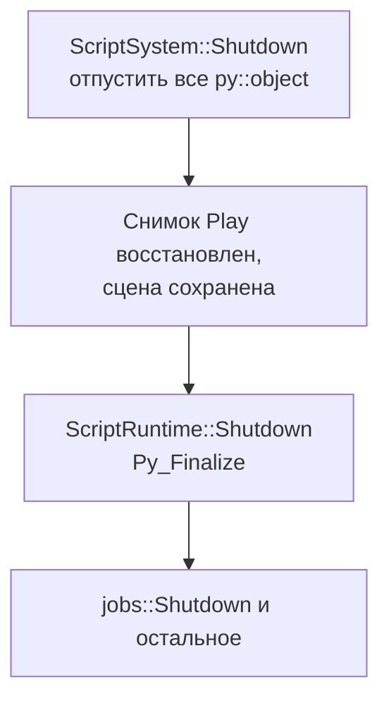

# T0: каркас Python-рантайма

## Зачем это нужно

Все остальные задачи ЛР2 опираются на то, что внутри движка уже работает интерпретатор Python. T0 закладывает этот фундамент: как Python попадает в сборку и на диск, как он запускается и останавливается, куда уходит `print` и кто имеет право его вызывать. Игровой логики, компонентов и событий здесь ещё нет — их добавляют T2 (API) и T3 (жизненный цикл).

PR [#18](https://github.com/DvornikovArtem/myengine/pull/18) `scripting/t0-runtime`, влит 06.10.2026.

## Что сделано

| Что | Где | За что отвечает |
| --- | --- | --- |
| Python 3.14.6 (заголовки, `python314.lib`) | `external/python/` | Сборка встраивает интерпретатор как библиотеку |
| Рантайм Python | `external/runtime/` | `python314.dll`, `python314.zip` (стандартная библиотека), лицензия; около 11 МБ |
| pybind11 3.1.0 | `external/pybind11/include/` | Описание того, что видно из Python (header-only) |
| Цели CMake | [CMakeLists.txt](../../CMakeLists.txt), [engine/CMakeLists.txt](../../engine/CMakeLists.txt) | `myengine_python` (INTERFACE) и импортированная `python314.lib` |
| `ScriptRuntime` | [ScriptRuntime.h](../../engine/include/myengine/scripting/ScriptRuntime.h), [ScriptRuntime.cpp](../../engine/src/scripting/ScriptRuntime.cpp) | Запуск и остановка интерпретатора, `sys.path`, перенаправление `print` |
| Модуль `myengine` | [ScriptBindings.cpp](../../engine/src/scripting/ScriptBindings.cpp) | `log`, `Vec3`, `Entity` (пока только `id` и `alive`) |
| Контекст скриптов | [ScriptContext.h](../../engine/src/scripting/ScriptContext.h), [EntityRef.h](../../engine/src/scripting/EntityRef.h) | Указатели на `Logger` и `World`, id главного потока, ссылка на сущность |
| Заглушки | `ScriptSystem`, `PrefabLibrary`, `FileWatcher` | Заголовки и пустые методы, которые заполняют T3, T4 и T5 |

Публичные заголовки (`engine/include/...`) не подключают `pybind11` и `Python.h`: всё питоновское живёт в `engine/src/scripting/`. Остальной движок и редактор от Python не зависят.

## Python в сборке и на диске

Установленный на машине Python не нужен и не мешает: версия и файлы лежат в репозитории.

- В CMake есть цель `myengine_python`: include-пути `external/python/include` и `external/pybind11/include` подключены как `SYSTEM`, чтобы `/W4` не ругался на чужой код. К ней прилинкована `python314.lib`. `find_package(pybind11)` не используется: он сам ищет Python в системе. Если `Python.h`, `python314.lib` или `pybind11/embed.h` не найдены, конфигурация CMake останавливается с понятной ошибкой.
- `target_link_directories(... INTERFACE ".../external/python/libs")` нужен потому, что `pyconfig.h` просит `python314.lib` по имени (`#pragma comment(lib)`), и каталог должен дойти до exe через статическую библиотеку движка.
- `ScriptBindings.cpp` собирается с `/bigobj`: pybind11 порождает много секций в одном объектном файле.
- Для Debug и для RelWithDebInfo линкуется одна и та же `python314.lib`; `python314_d.lib` не используется.
- `myengine_copy_runtime_assets` ([cmake/CopyRuntimeAssets.cmake](../../cmake/CopyRuntimeAssets.cmake)) после сборки копирует `external/runtime` рядом с exe (и рядом с каждым тестом). `python314.dll` нельзя загружать лениво: pybind11 импортирует из неё данные (например, `PyLong_Type`), поэтому она нужна при старте процесса.

## Запуск интерпретатора

`ScriptRuntime::Initialize` вызывается один раз в `Application::Initialize`, на главном потоке, сразу после job system и до рендера.

1. Проверяется `python314.zip` рядом с exe. Если его нет, в лог пишется ошибка, скрипты отключаются, а движок продолжает работу (`Scripting is disabled`).
2. `PyPreConfig` в изолированном режиме с `utf8_mode = 1`: `open()` в скриптах по умолчанию читает UTF-8.
3. `PyConfig` в изолированном режиме: переменные окружения `PYTHONHOME` / `PYTHONPATH`, пользовательские пакеты и установленный Python игнорируются. `write_bytecode = 0` — `__pycache__` в `assets/scripts` не появляется; `install_signal_handlers = 0` — сигналы остаются у движка.
4. `home` — каталог exe, `sys.path` собирается вручную из трёх путей: `python314.zip`, каталог exe (для `*.pyd`), папка скриптов. Все пути передаются как `wchar_t*` (`std::filesystem::path::c_str()` на Windows), поэтому кириллица в пути пользователя ничего не ломает.
5. `py::initialize_interpreter(&config, 0, nullptr, false)`; последний аргумент `false` — каталог программы в `sys.path` не добавляется.
6. Выполняется стартовый код: `import myengine`, подмена `sys.stdout` / `sys.stderr` и проверочная строка в лог.

Папка скриптов выбирается в `Application::Initialize`: `MYENGINE_SOURCE_DIR/assets/scripts`, а если её нет — `<exe>/assets/scripts`. Скрипты читаются из исходников, а не из копии рядом с exe, чтобы правки в редакторе кода видел hot reload (T5).

## `print` в лог

Приложение собрано как `WIN32`, консоли нет, и обычный `print` молча ничего бы не вывел. Поэтому стартовый код заменяет потоки объектом, который копит текст и отдаёт каждую законченную строку в `Logger`:

```python
sys.stdout = _LogStream(myengine.log.info)
sys.stderr = _LogStream(myengine.log.error)
```

В лог строка попадает с префиксом `[script]`: `print("hi")` → `[INFO] [script] hi`, текст в `stderr` → уровень `ERROR`. При `Shutdown` недописанная строка сбрасывается (`flush`), и потоки возвращаются к штатным до остановки интерпретатора.

## Модуль `myengine` в T0

```python
import myengine as me
me.log.info("текст")          # debug / info / warn / error
v = me.Vec3(1, 2, 3) + me.Vec3(1, 1, 1)   # Vec3(2, 3, 4)
```

- `log.debug|info|warn|error(message)` пишет в `logs/myengine.log` с префиксом `[script]`.
- `Vec3`: `x, y, z`, `+`, `-`, унарный минус, умножение и деление на число, `==`, `length()`, `normalized()`, `dot`, `cross`, `repr`. Это значение: Python получает **копию**, поэтому позднее `t.position.x += 1` изменит только копию (T2 описывает, как правильно присваивать вектор целиком).
- `Entity` — ссылка `id` + проверка «жива ли». У неё нет конструктора в Python, сущность всегда приходит от движка. Сырых указателей на данные движка скрипт не получает ни в T0, ни позже.

Модуль объявлен через `PYBIND11_EMBEDDED_MODULE`. Движок — статическая библиотека, и линковщик выбросил бы объектный файл с этим макросом, на который никто не ссылается. Поэтому `ScriptRuntime::Initialize` вызывает пустую `EnsureBindingsLinked()` из того же файла — без неё `import myengine` бы падал.

## Один поток и порядок остановки

Python вызывается только с главного потока, на котором создан интерпретатор. `ScriptContext` запоминает его id, а макрос `MYENGINE_ASSERT_SCRIPT_THREAD()` проверяет его в каждой точке входа (это `assert`, то есть работает в Debug). `GIL` держится всю сессию; задачи job system Python не трогают (почему так — в [architecture.md](architecture.md), раздел «Потоки»).

Порядок объявления членов `Application` важен: `scriptRuntime_` объявлен раньше `world_`, значит при уничтожении мир (а с ним `ScriptSystem` и его Python-объекты) всегда исчезает раньше интерпретатора. Порядок остановки в `Application::Shutdown`:



Если поменять первый и третий шаги местами, деструктор `py::object` сработал бы после остановки интерпретатора, и выход упал бы. Повторный вызов `ScriptRuntime::Shutdown` безопасен.

`ScriptSystem` зарегистрирован в `Application::Initialize` после `PhysicsSystem`, поэтому события физики текущего кадра доходят до скриптов в том же кадре (подробнее — в [T3](t3-lifecycle.md)).

## Проверка

Отдельных автотестов в PR #18 нет: каркас проверяется тем, что рантайм поднимается в каждом следующем тесте и в самом приложении. В логах сохранённых прогонов (например, [t6_debug_engine.log](../measurements/lab2/tests/ivan/t6_debug_engine.log)) есть записи этого запуска:

```text
[INFO] [script] Python 3.14.6 is ready, Vec3 check: Vec3(2, 3, 4)
[INFO] ScriptRuntime: initialized, sys.path = ['...\python314.zip', '...', '...\assets\scripts']
[INFO] ScriptRuntime: shut down
```

Первая строка — результат стартового кода (печатается через перенаправленный `print`, значит, работают и `import myengine`, и `Vec3`, и вывод в лог), вторая показывает итоговый `sys.path`, третья — штатную остановку.

Сборка и запуск:

```powershell
setup.bat
build.bat Debug
run.bat
```

Затем в `logs/myengine.log` искать `ScriptRuntime:`.
