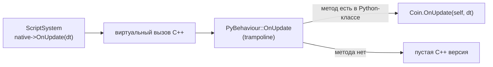
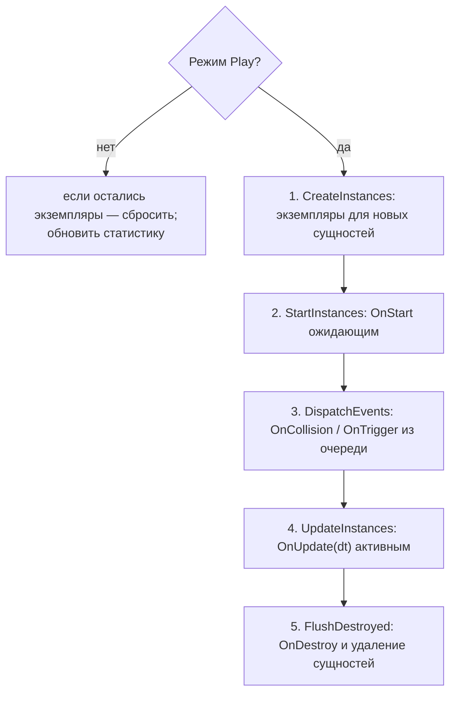

# T3: жизненный цикл скриптов и вызовы «движок → скрипт»

## Зачем это нужно

T0 запустил интерпретатор, T2 научил скрипт обращаться к движку. T3 — обратное направление: **движок вызывает скрипт**. Скрипт — это Python-класс, унаследованный от `myengine.Behaviour`; движок создаёт его экземпляры по данным сцены, вызывает `OnStart`, `OnUpdate`, `OnCollision`, `OnTrigger`, `OnDestroy` и отвечает за то, чтобы сбой одного скрипта не ронял остальное.

PR [#20](https://github.com/DvornikovArtem/myengine/pull/20) `scripting/t3-lifecycle`, влит 08.10.2026.

## Что сделано

| Что | Где | За что отвечает |
| --- | --- | --- |
| `Behaviour` + `PyBehaviour` | [Behaviour.h](../../engine/src/scripting/Behaviour.h), [BehaviourBindings.cpp](../../engine/src/scripting/BehaviourBindings.cpp) | C++-базовый класс поведения и trampoline к Python |
| `GetModule` | [ScriptModules.h](../../engine/src/scripting/ScriptModules.h) | Единственная точка импорта модуля скрипта |
| `ScriptSystem` | [ScriptSystem.h](../../engine/include/myengine/scripting/ScriptSystem.h), [ScriptSystem.cpp](../../engine/src/scripting/ScriptSystem.cpp) | Экземпляры, шаги кадра, очередь событий, отложенное удаление, `SafeCall` |
| `entity.destroy()` | [ScriptBindings.cpp](../../engine/src/scripting/ScriptBindings.cpp) | Отложенное удаление сущности с детьми |
| `EventBus::Unsubscribe` | [EventBus.h](../../engine/include/myengine/events/EventBus.h) | Подписка возвращает токен, отписка безопасна изнутри обработчика |
| `ScriptStats` | [EditorState.h](../../engine/include/myengine/editor/EditorState.h), [SceneEditor.cpp](../../engine/src/ui/SceneEditor.cpp) | Счётчики в окне Statistics |

Данные скрипта в сцене (`ScriptComponent` с `module`, `className`, `props`) — это T1. T3 их читает, но не меняет формат.

## Behaviour и trampoline

Скрипт выглядит так (поля и их значения подробнее — в [T7](t7-script-inspector.md)):

```python
import myengine as me

class Coin(me.Behaviour):
    spin_speed: float = 90.0          # поле с аннотацией: значение из сцены / prefab

    def OnUpdate(self, dt):           # движок вызывает каждый кадр в Play
        t = self.entity.transform
        ...
```

В C++ `Behaviour` — обычный класс с пустыми виртуальными методами `OnStart`, `OnUpdate(dt)`, `OnCollision(other, point, normal, impulse)`, `OnTrigger(other)`, `OnDestroy`, `OnReload`. Поле `entity` заполняет движок до `OnStart`, из Python оно только читается.



Движок делает обычный виртуальный вызов. Если объект на самом деле Python-класс, `PyBehaviour` через `PYBIND11_OVERRIDE` ищет одноимённый Python-метод и вызывает его, а если метода нет — отрабатывает пустая версия. Класс зарегистрирован через `py::classh` (smart_holder) с `trampoline_self_life_support`, чтобы Python-часть объекта не пережила C++-часть и наоборот; кроме того, сам `ScriptSystem` держит `py::object` — это вторая линия защиты.

Правило для скриптов: свой `__init__` не писать (для старта есть `OnStart`). Если всё же нужно — вызывать `super().__init__()`, иначе pybind11 бросит `TypeError`, и экземпляр будет отключён.

## Один шаг скриптов

Скрипты идут **после физики**: события текущего кадра доходят до них в этом же кадре, а скорость, которую скрипт записал в `Rigidbody`, физика применит на следующем кадре. Это осознанная задержка в один кадр.



Зоны Tracy на шаги: `Scripts::Update` (весь шаг), `Scripts::Start`, `Scripts::Events`, `Scripts::OnUpdate`, `Scripts::Flush`. Позднее T5 добавила перед шагом 1 горячую перезагрузку (`Scripts::HotReload`, работает и вне Play).

Весь шаг обёрнут в `try/catch`: ни одно исключение не может выйти из `ScriptSystem::Update` и остановить цикл движка.

### Экземпляры

Экземпляр — это `py::object` + указатель на C++-вид того же объекта + состояние. Живёт в `ScriptSystem`, а не в `ScriptComponent`: компонент — данные для сцены, сериализатора и снимка Play, экземпляр — состояние времени выполнения. Поэтому ECS и сериализатор о Python ничего не знают.

Состояния: `PendingStart` → `Active` → `Faulted`.

Создание экземпляра (`CreateInstances`) для каждой записи `ScriptComponent`:

1. `GetModule(module)` → `module.<className>`;
2. проверка, что это подкласс `myengine.Behaviour` (иначе ошибка `<module.Class> is not a subclass of myengine.Behaviour`);
3. `cls()`, затем `native->entity = EntityRef{id}`;
4. значения `props` записываются в поля (`apply_props`): для неизвестного поля или значения не того типа в лог идёт предупреждение, поле остаётся со значением по умолчанию.

Если создание упало, экземпляр остаётся заглушкой в состоянии `Faulted`, чтобы ошибка не повторялась каждый кадр. Перед обходом список новых сущностей собирается заранее: Python может менять мир, а менять реестр во время его обхода нельзя.

**Тайминг спавна.** `world.spawn` создаёт сущность сразу, но её скрипты получают экземпляры и `OnStart` на шаге 1–2 **следующего** кадра. Шаг 4 обходит копию списка id, а не живой реестр, поэтому спавн внутри `OnUpdate` безопасен.

### Отложенное удаление

`entity.destroy()` не удаляет сразу: `World::DestroyEntity` немедленный, а удаление посреди обхода ломает итераторы. Вызов кладёт id в очередь и помечает сущность (`destroyPending`); повторный `destroy()` ничего не делает. До шага 5 сущность ещё `alive`, но событий ей уже не доставляют и `OnUpdate` не вызывают.

Шаг 5 для каждой сущности из очереди:

1. собирает поддерево (сущность и все дети, родитель первым);
2. вызывает `OnDestroy` у активных экземпляров поддерева, пока все его сущности ещё живы;
3. удаляет экземпляры и сами сущности, дети раньше родителя.

`OnDestroy` может сам запросить удаление других сущностей; такие запросы обрабатываются следующим раундом, раундов не больше 16 за кадр, остаток уходит на следующий кадр с предупреждением в лог.

### События физики

`ScriptSystem` подписывается на `CollisionEvent` и `TriggerEvent`, но обработчик только копирует событие в `std::vector`. Вызывать скрипт прямо из подписки нельзя: события публикуются внутри шага физики, а скрипт мог бы удалить или создать тело в середине солвера. Кроме того, `EventBus` не был реентерабельным, поэтому в T3 его дополнили `Unsubscribe`: подписка возвращает токен, отписка изнутри обработчика безопасна (слот очищается сразу, удаляется после текущего `Publish`), а `ScriptSystem` отписывается в деструкторе и не оставляет в шине лямбду с висячим `this`.

На шаге 3 очередь доставляется так:

- `OnCollision` и `OnTrigger` получают скрипты **обеих** сущностей пары; нормаль для второй сущности развёрнута (`-normal`), то есть всегда направлена от получателя к собеседнику;
- мёртвым и помеченным на удаление событий не шлют;
- если оба коллайдера триггеры, физика присылает событие дважды — повторы одной пары за кадр отбрасываются.

## Ошибки: SafeCall и Faulted

Каждый вызов C++ → Python идёт через `SafeCall`. Он ловит `py::error_already_set` (исключение Python) и `std::exception` (на случай исключения из биндинга). При ошибке:

- в лог пишется строка вида `Script error: <файл>:<строка>: <ТипОшибки>: <текст> [<модуль>.<Класс>.<метод>]`, ниже — полный traceback. Файл и строка берутся из последнего кадра traceback, лежащего в `assets/scripts`; для `SyntaxError` — из самого исключения;
- ошибка попадает в `GetRecentErrors()` (последние 32) и в счётчик ошибок;
- **только этот экземпляр** становится `Faulted`, его методы больше не вызываются. Остальные скрипты и движок работают, а одна опечатка в `OnUpdate` не превращается в 60 одинаковых ошибок в секунду.

`Faulted`-экземпляр оживает после Stop → Play или, начиная с D1, сразу после горячей перезагрузки своего файла ([D1](d1-play-reload.md)). Исключения из биндингов (например, `EntityDeadError`) pybind11 превращает в обычные исключения Python: скрипт может поймать их через `try/except`, а если не поймал — работает та же схема.

Бесконечный цикл (`while True: pass`) в скрипте повесит главный поток. Это известное ограничение; защита (лимит времени на вызов) в план не входит.

## Сброс, Play/Stop и выход

- Скрипты выполняются только в Play. Stop восстанавливает мир из снимка и публикует `SceneLoadedEvent`; по нему `ScriptSystem::ResetInstances()` выбрасывает все экземпляры (без `OnDestroy`) и очищает очереди. Следующий Play создаёт экземпляры заново с нуля. Если режим не Play, а экземпляры ещё остались, `Update` тоже вызывает `ResetInstances`.
- `Shutdown()` вызывается из `Application::Shutdown` до остановки интерпретатора. Если интерпретатор к этому моменту уже не жив, ссылки на `py::object` намеренно не отпускаются (`release()`): их деструктор после `Py_Finalize` уронил бы выход.

## Статистика

В окно Statistics добавлены строки (обновляются каждый кадр, кроме двух, которые считаются раз в секунду):

```text
Scripts: <всего> (active <N>, faulted <N>)
Script modules: <N>      // модулей из assets/scripts в sys.modules, раз в секунду
Python objects: <N>      // len(gc.get_objects()), раз в секунду
Script errors: <N>       // всего с запуска
```

Для проверки утечек на долгой сессии: после Stop `Scripts:` равно 0, а `Script modules` и `Python objects` не растут.

## Проверка

В PR #20 отдельных автотестов нет. Поведение описанного здесь слоя позже проверяет `script_api` (тест Ивана, исходники — [ScriptApiTests.cpp](../../tests/scripting/ScriptApiTests.cpp), [api_behaviours.py](../../tests/scripting/api_behaviours.py)): события доставляются обеим сторонам и без дублей, ошибка в `OnUpdate` переводит экземпляр в `Faulted` и он больше не вызывается, чужой скрипт при этом остаётся `Active`, ошибка в сообщении `me.send` отключает получателя, запись ошибки содержит файл и строку, отложенное удаление работает для поддерева и при повторных вызовах, Stop освобождает экземпляры и обнуляет счётчик. Последние сохранённые прогоны: [T8, Debug](../measurements/lab2/tests/ivan/t8_debug_ctest.log) и [RelWithDebInfo](../measurements/lab2/tests/ivan/t8_relwithdebinfo_ctest.log) — CTest 7 из 7.

Руками: в Play открыть окно Statistics и убедиться, что есть строки `Scripts:`, `Script modules:`, `Python objects:`, `Script errors:`; вписать в `OnUpdate` скрипта `self.entity.no_such()` — в логе появится `Script error: <файл>:<строка>: ...`, этот экземпляр станет `Faulted`, остальные продолжат работать.
