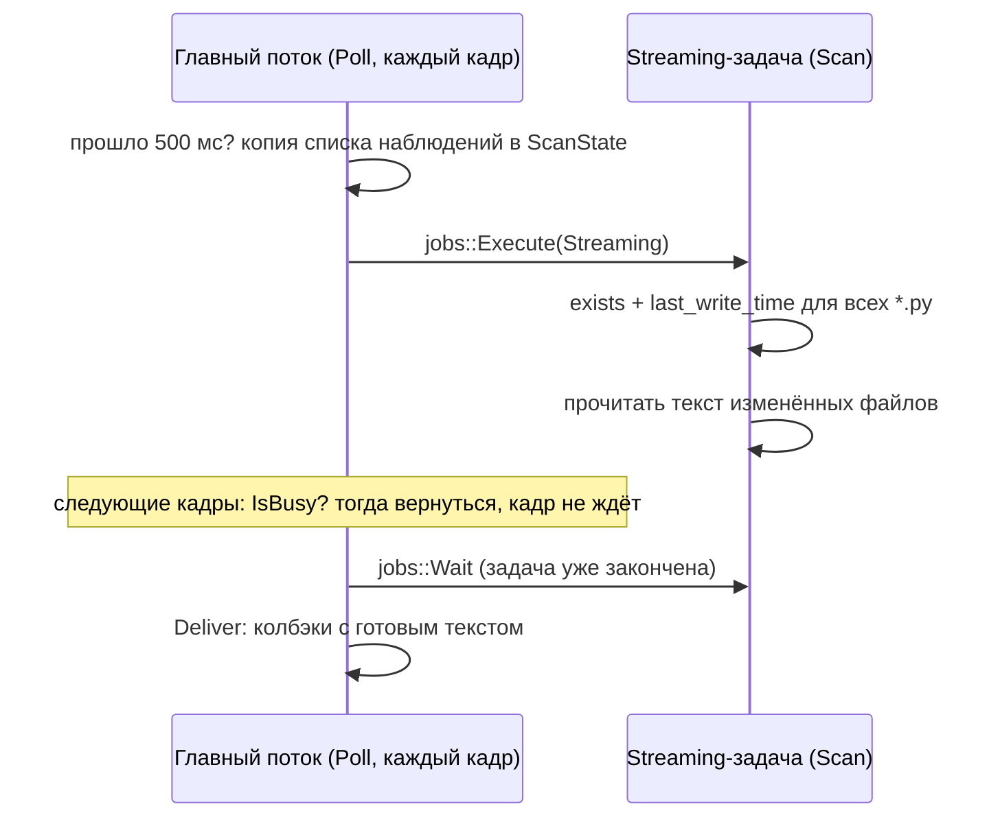

# T5 + D3: горячая перезагрузка скриптов на job system

## Зачем это нужно

Требование ЛР2: поменять число или условие в файле скрипта и увидеть изменение без перезапуска движка. T5 делает это минимально: изменение файла подхватывается автоматически (или по F5), код перезагружается, а ошибка в новой версии не ломает старую. D3 — допфича «hot reload через job system»: опрос файлов и чтение изменённых скриптов выполняет задача `Streaming`-пула, а не главный поток. Перезагрузка в уже запущенной игре (Play) — отдельная задача [D1](d1-play-reload.md).

PR [#21](https://github.com/DvornikovArtem/myengine/pull/21) `scripting/t5-hot-reload`, влит 08.10.2026.

## Что сделано

| Что | Где | За что отвечает |
| --- | --- | --- |
| `FileWatcher` | [FileWatcher.h](../../engine/include/myengine/core/FileWatcher.h), [FileWatcher.cpp](../../engine/src/core/FileWatcher.cpp) | Наблюдение за файлами по `last_write_time`, опрос и чтение в `Streaming`-задаче |
| Вспомогательный модуль | [ScriptHelpers.cpp](../../engine/src/scripting/ScriptHelpers.cpp) | Python-функции `reload_module`, `check_syntax`, `defines_behaviour`, `describe_fields`, `apply_props`, `describe_error`, `stats` |
| `ScriptSystem::ProcessFileChanges`, `RequestReloadAll` | [ScriptSystem.cpp](../../engine/src/scripting/ScriptSystem.cpp) | Применение изменений на главном потоке |
| `DescribeFields`, `ClearFieldCache` | [ScriptRuntime.cpp](../../engine/src/scripting/ScriptRuntime.cpp) | Поля поведения из аннотаций класса (для инспектора, T7) |
| F5 и кнопка Reload scripts | [Application.cpp](../../engine/src/core/Application.cpp), [SceneEditor.cpp](../../engine/src/ui/SceneEditor.cpp) | Ручная перезагрузка всех скриптов |

Вспомогательные функции, которые раньше лежали строкой внутри `ScriptSystem.cpp`, вынесены в служебный модуль `_myengine_helpers`. Он создаётся в `ScriptRuntime::Initialize` и живёт внутри интерпретатора, поэтому в C++ нет объекта, который надо отпускать до `Py_Finalize`.

## FileWatcher на Streaming-пуле (D3)

`core::FileWatcher` (в T0 был заглушкой) стал асинхронным. Главный поток не ждёт диск: он только запускает задачу и забирает готовый результат.



- Интервал опроса — 500 мс. Список наблюдений копируется в задачу, поэтому `Watch` во время сканирования безопасен. Задача трогает только свои данные (`ScanState`), никогда Python и мир.
- `WatchDirectory(папка, ".py")` следит за всеми `*.py` в `assets/scripts` и подпапках, включая файлы, созданные позже. Папки `__pycache__` пропускаются.
- Первое сканирование только запоминает состояние (baseline): при старте ничего не «изменилось».
- Новый файл, изменённый файл и удалённый файл попадают в результат; для изменённого сразу прочитан весь текст (`FileChange.contents`), так что главный поток текст с диска не читает.
- Исключения не выходят из задачи (в таком случае результат пропускается и следующий опрос пробует снова).
- `Stop()` ждёт идущее сканирование; `ScriptSystem::Shutdown` вызывает его до `jobs::Shutdown`.
- Tracy-зона задачи — `FileWatcher::Scan`.

Python в задаче не используется: GIL и состояние потока привязаны к главному потоку (см. [architecture.md](architecture.md), раздел «Потоки»), поэтому `compile` и подмена модулей остаются на главном.

## Применение изменений

`ScriptSystem::Update` на шаге 0 (зона `Scripts::HotReload`) вызывает `watcher.Poll()` и `ProcessFileChanges()`. Это работает в любом режиме, включая Edit.

Для каждого изменённого файла:

1. Путь `assets/scripts/enemies/chaser.py` превращается в имя модуля `enemies.chaser`. Удалённый файл — только предупреждение, загруженный код остаётся до следующего запуска. Пустой файл пропускается: редактор мог обрезать его и дописать через мгновение, полный текст придёт со следующим сканированием.
2. Модули, которые ещё не импортировались, только проверяются на синтаксис (`check_syntax`): ошибку видно сразу, а Python прочитает файл с диска, когда скрипт его запросит.
3. Для уже загруженных работает `reload_module`:

```python
code = compile(source, path, "exec")
spec = importlib.util.spec_from_file_location(name, path)
module = importlib.util.module_from_spec(spec)
exec(code, module.__dict__)
sys.modules[name] = module        # подмена только после успеха
```

Код выполняется в **новом объекте модуля**, а не через `importlib.reload`: `reload` выполняет код в старом модуле, и если верхний уровень упадёт посередине (`NameError`), модуль останется наполовину новым. Здесь при любой ошибке — `SyntaxError` или исключение на верхнем уровне — `sys.modules` не меняется, старая версия продолжает работать.

4. Ошибка проходит через тот же `SafeCall`: в лог идёт `файл:строка` и traceback, запись появляется в списке последних ошибок, а затем строка `... was not reloaded, the previous version keeps running`. Успех пишется как `ScriptSystem: hot reload <файл>`.
5. После успешной перезагрузки сбрасывается кэш описаний полей, и инспектор перечитывает поля из нового кода.

**Модули-помощники.** Если перезагружен модуль, в котором нет классов-наследников `Behaviour` (определяется функцией `defines_behaviour`), то `from utils import f` в других модулях всё ещё указывает на старую функцию. Тогда автоматически запускается перезагрузка всех скриптов (`a helper module changed, reloading all scripts`). Помощники перезагружаются первыми: остальные модули импортируют из них во время выполнения своего кода.

## F5 и кнопка Reload scripts

`ScriptSystem::RequestReloadAll()` просит `FileWatcher` при следующем сканировании считать изменёнными все файлы и помечает пакет как «перезагрузить всё». F5 доходит до приложения даже тогда, когда интерфейс редактора перехватывает клавиатуру (F5 добавлена в исключения рядом с F3). Та же функция вызывается кнопкой **Reload scripts** в тулбаре вьюпорта; у кнопки есть подсказка. Нужна как запасной вариант, если наблюдатель что-то пропустил, и для демонстрации.

## DescribeFields

`ScriptRuntime::DescribeFields(module, className)` возвращает поля поведения для инспектора и работает в Edit, когда экземпляров ещё нет: модуль просто импортируется.

- Поле — атрибут класса **с аннотацией типа** по всей цепочке наследования (`inspect.get_annotations`). Аннотации-строки (`from __future__ import annotations`) приводятся к типам.
- Поддерживаются `float`, `int`, `bool`, `str`. Другие типы и имена, начинающиеся с `_`, пропускаются.
- Значение по умолчанию берётся из атрибута класса и приводится к типу поля; если его нет, подставляется нулевое (`0.0`, `0`, `False`, пустая строка).
- Результат кэшируется по ключу `module.Class`. Ошибка импорта пишется в лог один раз как предупреждение, а список остаётся пустым, пока кэш не сбросят (после успешной перезагрузки).

Как эти данные использует редактор — в [T7](t7-script-inspector.md).

## Проверка

Автотест `script_api` ([ScriptApiTests.cpp](../../tests/scripting/ScriptApiTests.cpp), функция `TestHotReloadAndFields`) на настоящем интерпретаторе проверяет: у `ReloadProbe` описано 3 поля; после правки `speed: float = 3.0` → `8.0` и `RequestReloadAll` живой объект заменён новым с сохранённым состоянием, а ссылка на сущность осталась рабочей; кэш полей сброшен (значение по умолчанию в `DescribeFields` стало 8.0); файл с `def broken(:` не останавливает уже загруженный скрипт, `sys.modules` хранит прежний модуль, запись об ошибке содержит имя файла; при выключенном «Keep script state» объект после перезагрузки стартует заново. Этот же тест покрывает и D1. Сохранённые прогоны: [T8, Debug](../measurements/lab2/tests/ivan/t8_debug_ctest.log) и [RelWithDebInfo](../measurements/lab2/tests/ivan/t8_relwithdebinfo_ctest.log) — CTest 7 из 7, `script_api` проходит в обеих конфигурациях. Для самого PR #21 отдельных логов не сохранялось.

Вручную в `RelWithDebInfo` или `Debug`:

1. Запустить `run.bat` (откроется в Edit), в `assets/scripts/coin.py` поменять правило, например `me.send(self.manager_name, "add_score", self.score_value)` на `... self.score_value * 2)`, и сохранить. Примерно через полсекунды в `logs/myengine.log` появится `ScriptSystem: hot reload coin.py`; в Play монеты дают двойные очки. Правка значения по умолчанию (`score_value: int = 1`) здесь не видна: значение из `coin.prefab.json` важнее значения в коде.
2. Удалить двоеточие у `def`/`class`, сохранить: в логе `coin.py:<строка>: SyntaxError`, строка `was not reloaded`, игра идёт на старом коде. Вернуть двоеточие — подхватится.
3. F5 или кнопка Reload scripts перезагружает все скрипты.

Серии перезагрузок подряд, переименование класса и ошибки верхнего уровня входят в сценарии T9 (стабильность) — они в работе.
